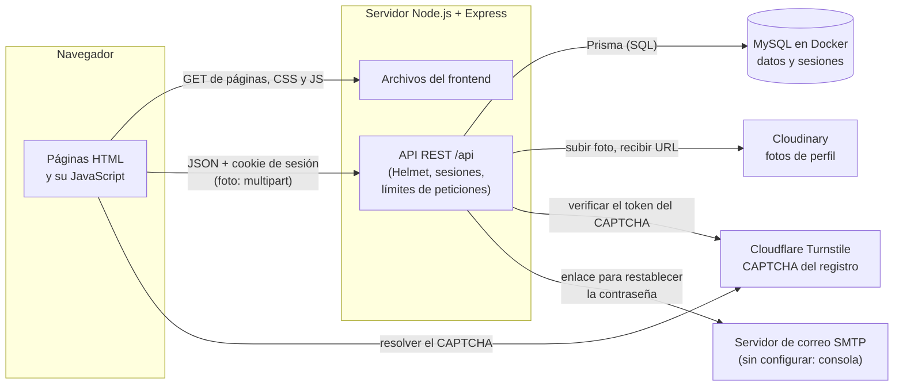
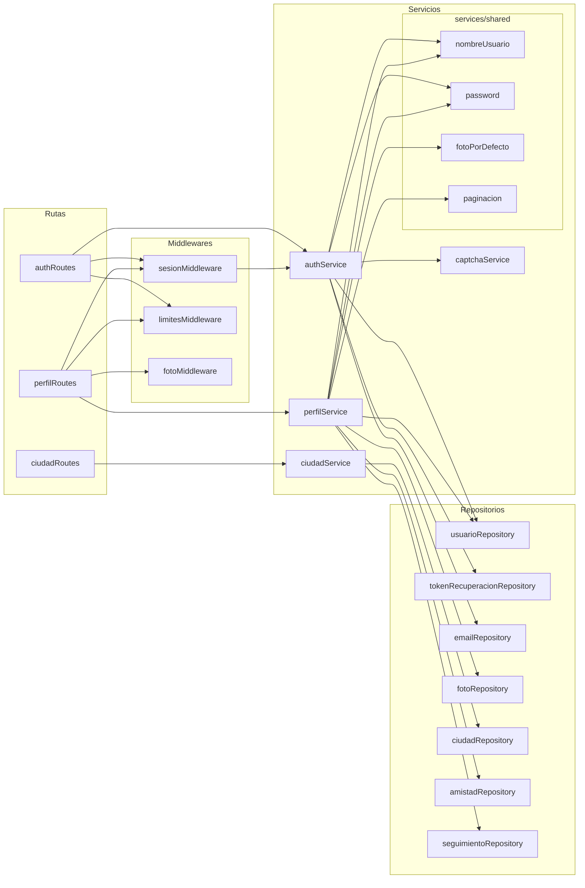
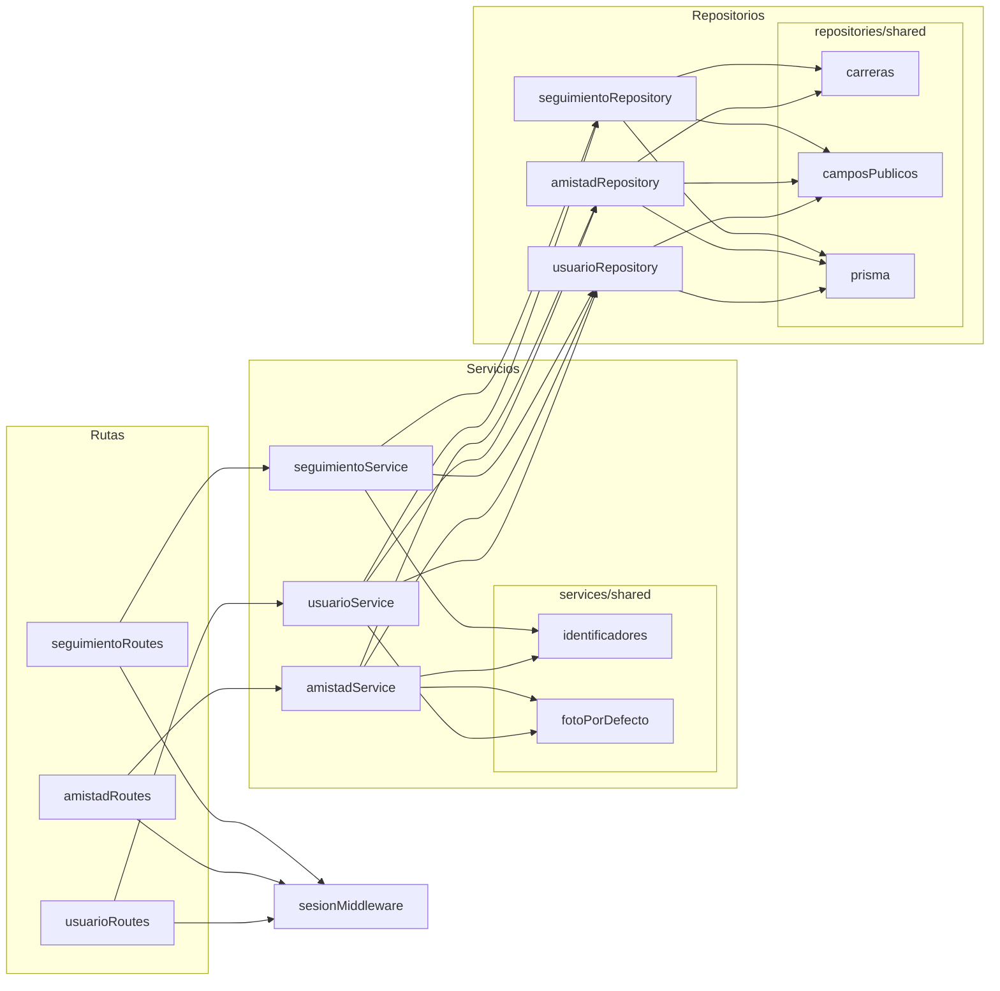
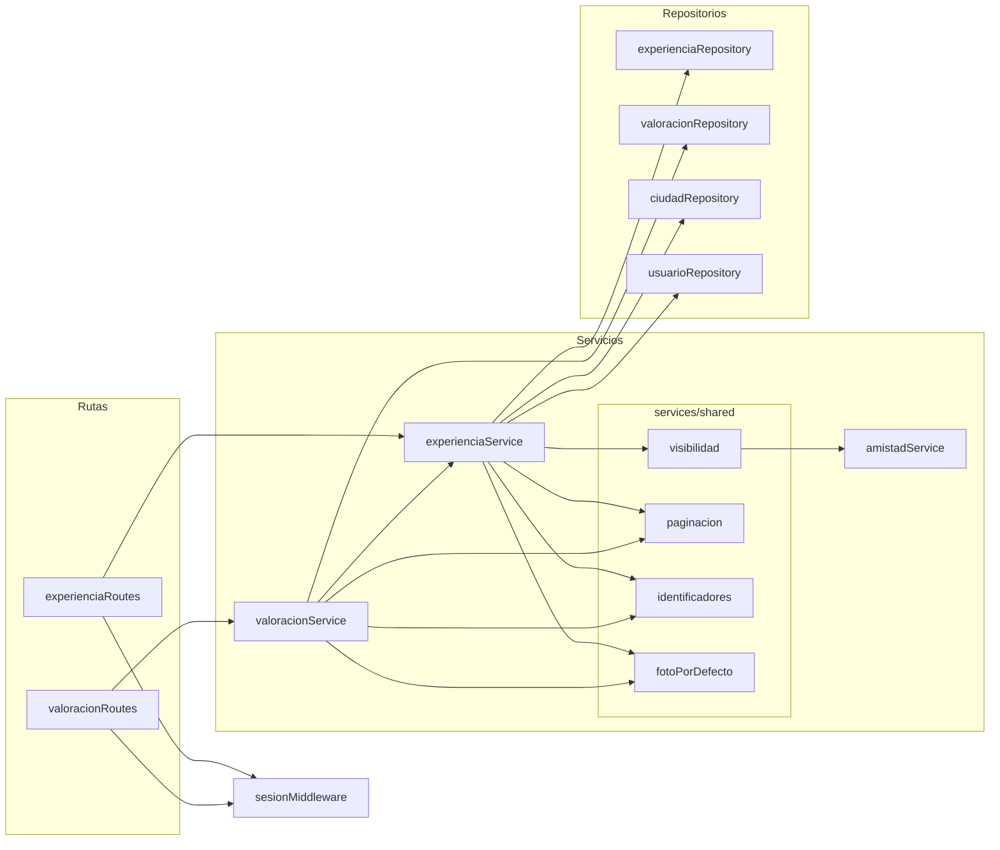
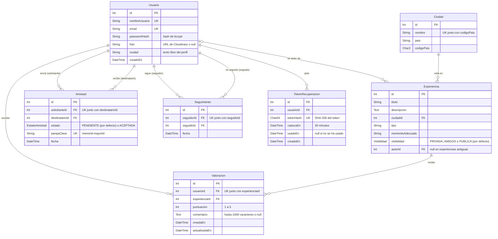
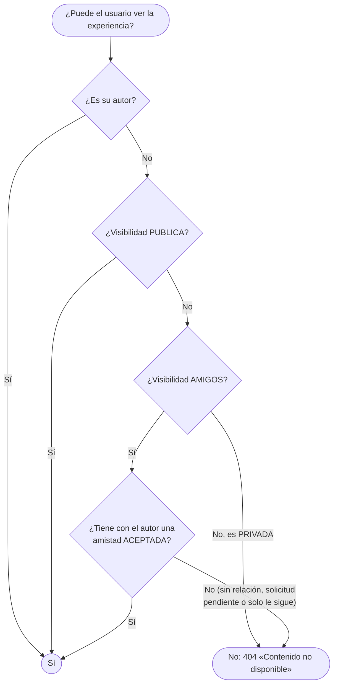
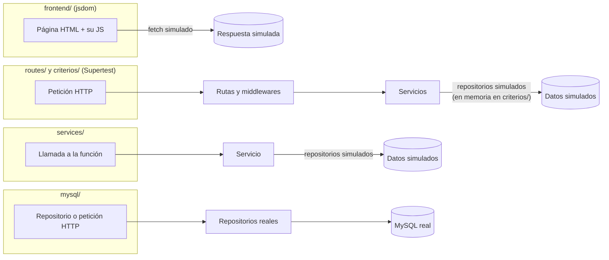

# Arquitectura — PlanB

> Arquitectura y diseño técnico del proyecto: las reglas estables. Parte de la [propuesta inicial](propuesta-inicial.md).
> Documentos relacionados: [referencia de la API](api.md), [flujos y estados](flujos.md), [pantallas](frontend.md) y [glosario](glosario.md).

Los diagramas están escritos en [Mermaid](glosario.md#mermaid): GitHub los dibuja directamente y, en Visual Studio Code, se ven con la extensión «Markdown Preview Mermaid Support» (sección 7).


### 1. Alcance técnico

PlanB se construye como una **aplicación web responsive**: una única web que se adapta tanto al ordenador como a la pantalla del móvil. No hay aplicación móvil nativa.

Funcionalidades implementadas, con su historia de usuario:

| Historia | Qué permite |
|---|---|
| CS-59 · Crear una cuenta | Registro con CAPTCHA, inicio y cierre de sesión |
| CS-64 · Contraseña segura | Requisitos de la contraseña, cambiarla desde el perfil y recuperarla por email |
| CS-47 · Crear mi perfil | Ver y editar el perfil propio, con su foto |
| CS-49 · Creación de experiencias | Crear experiencias con su ciudad del catálogo |
| CS-57 · Edición de experiencia | Editar las experiencias propias |
| CS-22 · Visibilidad experiencias | Privada, de amigos o pública, con su descripción en el formulario |
| CS-30 · Control de acceso | Solo se ve una experiencia si su visibilidad lo permite; si no, «Contenido no disponible» |
| CS-44 · Mis experiencias publicadas | Las experiencias de un usuario en su perfil, por páginas |
| CS-61 · Amistades y seguidores | Buscar personas, solicitudes de amistad y seguir |
| CS-45 · Mi número de amigos y seguidores | Contadores y listas en «Mi perfil» |
| CS-62 · Perfil de otro usuario | Su perfil público, la relación con él y sus experiencias |
| CS-01 · Valorar una experiencia | Puntuación del 1 al 5 y comentario opcional |
| CS-63 · Pantalla de valoraciones | La página de una experiencia con sus valoraciones; «Útil» y «Reportar» solo en la pantalla hasta CS-02 y CS-04 |
| CS-48 · Valoraciones de amigos y seguidores | Sección propia en la página de la experiencia |

El resto de módulos se construye después sobre la misma arquitectura.


### 2. Visión general

El sistema se organiza en **capas**. No son servicios independientes: hay un único backend con las capas separadas por dentro (carpetas y módulos), y un frontend que se comunica con él.

**D1 · Contexto.** Quién habla con quién y qué viaja en cada conexión.



* **Interfaz:** lo que ve y usa la persona. Son páginas HTML que piden datos al backend y los muestran.
* **Rutas:** reciben cada petición HTTP, comprueban con un *middleware* que el usuario tenga sesión iniciada y pasan la petición a la lógica de negocio.
* **Lógica de negocio (servicios):** aplica las reglas de las historias de usuario: qué puede hacer cada usuario, cómo se valida cada dato y qué se calcula.
* **Persistencia (repositorios):** la única parte del código que habla con la base de datos y con los servicios externos (Cloudinary y el correo). Lee y guarda datos y los devuelve como objetos de JavaScript.
* **MySQL:** almacena los datos. No sabe nada de reglas de negocio.

Cada capa solo se comunica con la de al lado, de modo que se puede probar o cambiar por separado sin tocar el resto.

#### 2.1. Capas y archivos

**D2 · Quién usa a quién.** Cada flecha es un `require` del código: la ruta llama a su servicio y el servicio a sus repositorios. Para que se pueda leer, va en tres diagramas por área. Las carpetas `shared/` reúnen lo que usan varios archivos de la misma capa.

*D2a · Cuenta y perfil*



*D2b · Personas y relaciones*



*D2c · Experiencias y valoraciones*



`valoracionService` usa `experienciaService.obtenerExperiencia` para comprobar que la experiencia existe y se puede ver: la regla de acceso de CS-30 está en un solo sitio. Todos los repositorios de MySQL usan `repositories/shared/prisma.js`; `fotoRepository` habla con Cloudinary y `emailRepository` con el servidor de correo.


### 3. Herramientas

Todo el proyecto está escrito en **JavaScript**, tanto el backend como el frontend.

| Capa | Herramientas |
|---|---|
| Base de datos | MySQL |
| Persistencia | Prisma |
| Backend (rutas y lógica) | Node.js, Express, bcrypt, express-session (con prisma-session-store), helmet, express-rate-limit, multer, Nodemailer |
| Interfaz | HTML, CSS, JavaScript, Bootstrap (solo su CSS) |
| Protección contra bots | Cloudflare Turnstile |
| Imágenes | Cloudinary |
| Entorno de desarrollo | Docker (docker-compose) |
| Pruebas | Jest (con jsdom), Supertest |

#### 3.1. MySQL

Sistema de gestión de bases de datos relacional. Guarda la información en tablas (usuarios, experiencias, valoraciones...) relacionadas entre sí mediante claves, y la consulta con SQL.

* Es adecuado para datos muy relacionados, como los de PlanB: un usuario tiene experiencias, que tienen valoraciones de otros usuarios.
* Garantiza la integridad de los datos: claves foráneas, restricciones de unicidad (por ejemplo, una sola valoración por usuario y experiencia) y transacciones.
* Es muy conocido y tiene mucha documentación.

#### 3.2. Prisma

ORM (*Object-Relational Mapping*) para Node.js. El esquema de la base de datos se describe en un único archivo, `backend/prisma/schema.prisma`, y a partir de él Prisma crea las tablas en MySQL y genera un cliente para consultarlas desde JavaScript.

```js
const experiencias = await prisma.experiencia.findMany({
  where: { autorId: 7, visibilidad: { in: ['AMIGOS', 'PUBLICA'] } },
  include: { ciudad: true },
});
```

El ejemplo de consulta pertenece a un repositorio.

**D3 · Modelo de datos.** Las tablas de `schema.prisma`, con sus claves primarias (PK), foráneas (FK) y únicas (UK). En cada relación, `||` significa «exactamente uno», `|o` «cero o uno» y `o{` «cero o muchos».



Además, la tabla `Session` guarda las sesiones de express-session (la gestiona la librería prisma-session-store y no se relaciona con las demás).

Qué garantiza cada restricción:

* **Experiencia:** `ciudadId` identifica una ciudad del catálogo; la clave foránea impide usar ciudades inexistentes y borrar ciudades con experiencias. `autorId` admite ausencia de valor únicamente para conservar registros anteriores sin autor conocido; la creación desde la API siempre asigna al usuario de la sesión. `visibilidad` vale `PUBLICA` por defecto, de modo que las experiencias anteriores y las creadas sin indicarla siguen visibles.
* **Ciudad:** el nombre por sí solo no es único; la combinación de código de país y nombre sí lo es. País y código admiten ausencia de valor para conservar ciudades anteriores pendientes de revisión.
* **Valoracion:** la restricción única `[usuarioId, experienciaId]` impide que un usuario tenga dos valoraciones de la misma experiencia, también con peticiones simultáneas. La base de datos solo garantiza que la puntuación sea un entero; el rango y la longitud del comentario los valida el servicio.
* **Amistad:** entre dos usuarios solo puede haber una relación, en cualquier sentido: `parejaClave` guarda la pareja sin orden (`"3-7"` tanto si 3 envió la solicitud a 7 como al revés) y es única. Rechazar una solicitud o eliminar la amistad borra la fila.
* **Seguimiento:** es direccional; `[seguidorId, seguidoId]` es único, así que no se puede seguir dos veces a la misma persona.
* **TokenRecuperacion:** solo se guarda el hash del token del enlace, nunca el token. Si se borra el usuario, se borran sus enlaces.

El catálogo inicial de capitales y sedes se guarda en `backend/data/capitales.json` y se carga desde `backend/` con `npm run db:seed`, después de aplicar las migraciones. La carga pasa por un servicio y un repositorio, funciona sin internet y puede repetirse sin duplicar sus entradas. Incluye 195 países y 201 entradas. En la interfaz, la ciudad se elige en un desplegable que se rellena con `GET /api/ciudades`.

* **Migraciones:** cada cambio del esquema genera un archivo de migración que se guarda en git. Cualquier miembro del equipo deja su base de datos al día con `npx prisma migrate deploy` (o `npm run db:migrate`, que además crea migraciones nuevas).
* **Relaciones sencillas:** los datos relacionados se piden con `include` o `select`, sin escribir los JOIN a mano. Los campos que se pueden enseñar de un usuario (`id`, `nombreUsuario`, `foto`) se definen una sola vez en `repositories/shared/camposPublicos.js`.
* **Seguridad:** todas las consultas van parametrizadas, lo que evita la inyección SQL.

#### 3.3. Node.js

Entorno que ejecuta JavaScript fuera del navegador, en el servidor.

* Se usa el mismo lenguaje en el frontend y en el backend.
* Tiene el ecosistema de paquetes más grande que existe (npm), con librerías para casi cualquier necesidad.
* Maneja bien muchas peticiones simultáneas, como las de una aplicación web.

#### 3.4. Express

Framework web minimalista para Node.js. Asocia cada URL y método HTTP (`GET /api/experiencias/7`, `PUT /api/experiencias/7/valoracion`...) con la función que la atiende.

* Es sencillo y tiene muy poca configuración inicial.
* Funciona con *middlewares*: funciones que se ejecutan antes de atender la petición, como comprobar la sesión o limitar los intentos. Así esas comprobaciones se escriben una vez y se reutilizan en todas las rutas.
* También sirve archivos estáticos, así que el mismo servidor entrega tanto la API como las páginas HTML.

#### 3.5. bcrypt

Librería que calcula el *hash* de una contraseña, es decir, una transformación que no se puede deshacer.

* En la base de datos nunca se guarda la contraseña, solo su hash. Aunque alguien obtuviese la base de datos, no podría leer las contraseñas.
* Es lento a propósito y añade un valor aleatorio (*salt*) a cada contraseña, lo que dificulta mucho los ataques por fuerza bruta.

#### 3.6. express-session

Middleware de Express que gestiona las **sesiones** de usuario. Al iniciar sesión, el servidor crea una sesión y el navegador recibe una cookie con su identificador. En cada petición siguiente, el navegador envía esa cookie y el backend sabe qué usuario la hace.

* El navegador envía la cookie automáticamente, sin código extra en el frontend.
* La cookie se marca como `HttpOnly`, así que el JavaScript de la página no puede leerla, lo que protege frente a robos por XSS.
* Cerrar sesión es inmediato: basta con borrar la sesión en el servidor.
* Las sesiones se guardan en MySQL (tabla `Session`) mediante **@quixo3/prisma-session-store**, que usa el mismo cliente de Prisma. Así sobreviven a los reinicios del servidor, y las caducadas se borran solas.

#### 3.7. HTML, CSS y JavaScript

Las tres tecnologías básicas de la web. HTML define la estructura de cada página, CSS su aspecto y JavaScript su comportamiento. El JavaScript del frontend pide datos a la API con `fetch` y los inserta en la página.

* No hace falta ningún paso de compilación: los archivos se abren directamente en el navegador.
* No hay que aprender ningún framework adicional.

#### 3.8. Bootstrap

Librería de CSS y componentes (botones, formularios, tarjetas, menús...) listos para usar. PlanB carga solo su CSS: las ventanas emergentes usan el elemento `<dialog>` del navegador, porque la política de seguridad de contenidos no permite cargar scripts de otros servidores (sección 3.13).

* Su sistema de rejilla hace que las páginas se adapten al móvil sin escribir CSS específico, que es la base de una web responsive.
* Da un aspecto uniforme a todas las pantallas aunque las haga gente distinta.

#### 3.9. Cloudinary

Servicio en la nube para almacenar y servir imágenes. El backend sube cada foto a Cloudinary y en MySQL se guarda solo su URL.

* La base de datos no se llena de archivos pesados.
* Redimensiona y optimiza las imágenes automáticamente.
* El plan gratuito es suficiente para el proyecto.

El navegador envía la foto en un formulario *multipart* (el formato de los formularios con archivos). En el backend, **multer** la recibe en memoria, sin escribirla en disco, y el SDK oficial **cloudinary** la sube con las credenciales de la variable `CLOUDINARY_URL` de `.env`.

#### 3.10. Docker (docker-compose)

Docker ejecuta programas dentro de **contenedores**, que son entornos aislados con una configuración fija. `docker-compose` permite describir en un archivo (`docker-compose.yml`) qué contenedores levantar.

* Todo el equipo usa la misma versión y configuración de MySQL, sin instalarlo en su ordenador.
* La base de datos se levanta con un solo comando (`docker compose up -d`) y se puede borrar y recrear en segundos.

#### 3.11. Jest

Framework de pruebas para JavaScript. Ejecuta los tests, comprueba los resultados con aserciones (`expect(resultado).toBe(...)`) e indica qué ha fallado.

* Necesita muy poca configuración.
* Permite sustituir partes del sistema por simulaciones (*mocks*), por ejemplo para probar la lógica de negocio sin base de datos o sin subir fotos a Cloudinary.
* Con el entorno **jsdom** (`jest-environment-jsdom`) simula un navegador: carga el HTML y el JavaScript de una pantalla y comprueba lo que ve el usuario (mensajes, estado de los botones) sin abrir un navegador real.
* Mide la **cobertura**: qué partes del código ejecutan las pruebas (sección 9).

#### 3.12. Supertest

Librería que hace peticiones HTTP a la aplicación Express desde los tests, sin arrancar un servidor real.

* Permite probar cada endpoint de principio a fin: se envía una petición y se comprueban el código de estado y el JSON devuelto.
* Encaja directamente con los criterios de validación de las tarjetas de historias de usuario («si una experiencia pública pasa a privada, otro usuario no debe poder volver a consultarla»...).

#### 3.13. helmet

Middleware de Express que añade a cada respuesta las **cabeceras de seguridad** que le dicen al navegador cómo protegerse.

* **Política de contenido (CSP):** el navegador solo ejecuta scripts de nuestro propio servidor (y los del CAPTCHA de Cloudflare). Aunque alguien consiguiera colar un `<script>` en una página, no se ejecutaría. Por eso no se usan atributos como `onclick` ni scripts de otros servidores.
* Impide que otra web muestre PlanB dentro de un marco para engañar al usuario (*clickjacking*).
* Deja de anunciar que el servidor usa Express.

#### 3.14. express-rate-limit

Middleware que **limita cuántas peticiones** puede hacer una misma IP en un periodo de tiempo. Al superar el límite, responde `429 Too Many Requests`.

* Frena los ataques de fuerza bruta contra el login y el cambio de contraseña, la creación masiva de cuentas y el envío masivo de enlaces de recuperación.
* Se aplica solo a las rutas que lo necesitan, como un middleware más (`middlewares/limitesMiddleware.js`).

#### 3.15. Cloudflare Turnstile

**CAPTCHA** gratuito de Cloudflare que comprueba que quien usa un formulario es una persona y no un programa. La mayoría de las veces no pide nada al usuario: lo decide analizando el navegador.

* El navegador resuelve el CAPTCHA y envía un *token* junto con el formulario; el backend pregunta a Cloudflare si ese token es válido antes de hacer nada más.
* En el registro impide que un programa pruebe emails en masa para averiguar cuáles tienen cuenta.
* Para desarrollo, Cloudflare ofrece claves de prueba que siempre aceptan, así que no hace falta crear una cuenta hasta el despliegue.

#### 3.16. Nodemailer

Librería para enviar emails desde Node.js a través de un servidor de correo **SMTP**. PlanB la usa para el enlace de recuperación de la contraseña (CS-64).

* La dirección del servidor y sus credenciales van en la variable `SMTP_URL` de `.env`, así que se puede cambiar de proveedor sin tocar el código.
* Sin `SMTP_URL` (desarrollo), `repositories/emailRepository.js` escribe el email en la consola del servidor, para poder abrir el enlace sin configurar ningún proveedor.


### 4. Comunicación entre frontend y backend

* El backend expone una **API REST** que recibe y devuelve **JSON**. Todas sus rutas empiezan por `/api` (por ejemplo, `GET /api/experiencias/7`). La referencia completa de cada ruta está en [api.md](api.md).
* El resto de rutas sirven las páginas HTML del frontend. Frontend y API salen del **mismo servidor y el mismo dominio**, por lo que la cookie de sesión se envía sola y no hay que configurar CORS.
* Cada endpoint indica el resultado con el código HTTP correspondiente: `200`/`201`/`204` si ha ido bien, `400` si los datos son inválidos, `401` si no hay sesión, `403` si no hay permiso, `404` si el recurso no existe y `429` si se han hecho demasiados intentos.
* Los errores se devuelven como `{ "error": "mensaje" }`, con un mensaje en español que el frontend puede mostrar tal cual. `js/shared/api.js` lanza ese mensaje como error y le añade el código HTTP en `status`.
* Una experiencia que no existe y una que no se puede ver responden igual: **404 «Contenido no disponible»**, para no revelar que existe (CS-30).
* Los listados se piden por páginas con **paginación por cursor**: `?despuesDe=<id>&limite=<n>` y la respuesta trae `siguiente`, el valor para pedir la página siguiente (`null` si no hay más). Así no se repite ni se salta ningún elemento aunque la lista cambie entre dos peticiones ([flujo F9](flujos.md#f9-listas-con-cargar-más)).


### 5. Autenticación y autorización

#### 5.1. Autenticación

* Registro e inicio de sesión con **email y contraseña**. La secuencia completa está en los flujos [F1](flujos.md#f1-registro) y [F2](flujos.md#f2-inicio-de-sesión-y-petición-protegida).
* La contraseña se guarda como hash con **bcrypt** y tiene que cumplir los requisitos de CS-64 (`services/shared/password.js`): entre 8 y 72 bytes, mayúscula, minúscula, número y sin el nombre de usuario.
* La sesión se mantiene con **express-session** mediante una cookie `HttpOnly`. Al iniciar sesión se crea siempre una sesión nueva, para que nadie pueda reutilizar un identificador anterior.
* El middleware `requiereSesion` protege las rutas: sin sesión, o si el usuario de la sesión ya no existe, responde 401 y la petición no llega a la ruta. Así los servicios dan por bueno el usuario de la sesión.
* Todos los datos se validan en el backend (tipo, formato y longitud), aunque el formulario ya los compruebe.
* El login y el cambio de contraseña admiten un número limitado de intentos fallidos por IP, la recuperación de la contraseña un número limitado de peticiones, y el registro exige superar el CAPTCHA.

#### 5.2. Autorización

Los permisos se comprueban **siempre en el backend**. El frontend puede ocultar botones, pero eso no protege nada por sí solo.

* **Visibilidad de experiencias** (CS-22 y CS-30): cualquier consulta que devuelva experiencias (el detalle, el listado de un autor y las valoraciones) filtra según su visibilidad y según quién la pide. La regla está en un solo sitio, `services/shared/visibilidad.js`: `puedeVerExperiencia` decide sobre una experiencia y `nivelesVisibles` da los niveles que puede ver alguien entre las de un autor, para filtrar un listado en una sola consulta.
* **Propiedad:** solo el autor puede editar su experiencia (CS-57), y el autor no puede valorar la suya (CS-01).
* **Amistades:** solo el destinatario puede aceptar o rechazar una solicitud, y solo los dos participantes pueden eliminar una amistad (CS-61).

**D4 · Regla de visibilidad.** Lo que decide `puedeVerExperiencia(usuario, experiencia)`.



Los niveles que devuelve `nivelesVisibles` siguen la misma regla:

| Quién consulta | PRIVADA | AMIGOS | PUBLICA |
|---|:---:|:---:|:---:|
| El autor | ✓ | ✓ | ✓ |
| Un amigo con la amistad aceptada | | ✓ | ✓ |
| Alguien con una solicitud pendiente | | | ✓ |
| Un seguidor que no es amigo | | | ✓ |
| Cualquier otro usuario | | | ✓ |

El permiso se calcula en cada petición: si una experiencia pasa a privada o se elimina una amistad, el acceso se pierde en la siguiente consulta, aunque se use un enlace anterior.


### 6. Estructura del repositorio

```
ISW-Practica/
├── backend/
│   ├── data/capitales.json    # catálogo inicial de ciudades (npm run db:seed)
│   ├── prisma/
│   │   ├── schema.prisma      # esquema de la base de datos
│   │   ├── migrations/        # migraciones generadas por Prisma
│   │   └── seed.js            # carga del catálogo de ciudades
│   ├── src/
│   │   ├── routes/            # URLs de la API → llaman a su servicio (xRoutes.js)
│   │   ├── middlewares/       # sesión, límites de peticiones y recepción de la foto (xMiddleware.js)
│   │   ├── services/          # lógica de negocio (xService.js)
│   │   │   └── shared/        # reglas comunes: visibilidad, paginación, contraseña, ids...
│   │   ├── repositories/      # acceso a datos: MySQL con Prisma, Cloudinary y correo (xRepository.js)
│   │   │   └── shared/        # conexión con MySQL, almacén de sesiones y campos públicos
│   │   ├── errores.js         # crearError: errores con código HTTP, común a todas las capas
│   │   ├── app.js             # configuración de Express
│   │   └── server.js          # arranque del servidor
│   ├── tests/                 # pruebas con Jest, Supertest y jsdom (sección 9)
│   ├── .env.example           # variables de entorno necesarias (sin valores reales)
│   └── package.json           # dependencias, scripts de npm y configuración de Jest
├── frontend/
│   ├── *.html                 # una página por pantalla
│   ├── css/
│   ├── img/
│   └── js/                    # un archivo por página, con el mismo nombre que su HTML
│       └── shared/            # código común a varias páginas (api.js, pantalla.js...)
├── docker-compose.yml         # MySQL para desarrollo
└── documentacion/
    ├── customer-stories/      # documentos de partida y copia del libro de historias
    └── *.md                   # propuesta, arquitectura, api, flujos, frontend, glosario...
```

Las carpetas de `backend/src` se corresponden con las capas de la sección 2. Las rutas solo llaman a servicios, los servicios solo llaman a repositorios (y a otros servicios cuando hace falta) y solo los repositorios usan Prisma, Cloudinary o el correo.

Cada archivo lleva el nombre de su capa como sufijo, de modo que el nombre indica dónde está y con quién habla: `perfilRoutes.js` → `perfilService.js` → `usuarioRepository.js`. Cada `xRoutes.js` atiende un prefijo de la URL y llama solo a `xService.js` (la tabla de prefijos está en `routes/index.js`), y cada ruta lleva un comentario con el formato `// GET /api/... → servicio.función`. Las rutas y los servicios se agrupan por funcionalidad y los repositorios por tabla o almacén de datos, por eso varios servicios pueden usar el mismo repositorio. Lo que no pertenece a ninguna funcionalidad ni tabla concreta va en la carpeta `shared/` de su capa. Cada archivo empieza con un comentario que indica su capa, quién lo usa y qué usa.

Las claves y contraseñas (conexión a MySQL, credenciales de Cloudinary, secreto de sesión, servidor de correo) se guardan en `backend/.env`, que **no se sube a git**. El archivo `backend/.env.example` indica qué variables hay que rellenar.

El frontend no necesita instalación: Bootstrap se carga desde CDN y `js/shared/api.js` agrupa las llamadas a la API. Cada página carga primero `js/shared/api.js`, después los módulos compartidos que necesita y por último su propio archivo (`perfil.html` → `js/perfil.js`). El detalle de cada pantalla está en [frontend.md](frontend.md).


### 7. Instalación de herramientas

Para desarrollar solo hace falta instalar tres programas. Todo lo demás se instala solo o no necesita instalación:

* **MySQL** se ejecuta dentro de Docker, así que no se instala en el ordenador.
* **Express, Prisma, Jest y el resto de librerías** se descargan con `npm install` (sección 8).
* **Bootstrap** se carga desde CDN en cada página.

| Herramienta | Para qué | Versión |
|---|---|---|
| Git | Clonar el repositorio y trabajar con ramas | Cualquiera reciente |
| Node.js (incluye npm) | Ejecutar el backend e instalar sus librerías | LTS, 22 o superior |
| Docker (con Docker Compose) | Levantar MySQL | Cualquiera reciente |

Opcional: para ver los diagramas de la documentación en la vista previa de Markdown de Visual Studio Code, instalar la extensión **Markdown Preview Mermaid Support**. En GitHub se ven sin instalar nada.

#### 7.1. Windows

1. **Git:** descargar e instalar [Git for Windows](https://git-scm.com/download/win).
2. **Node.js:** descargar el instalador **LTS** de [nodejs.org](https://nodejs.org/) y seguir el asistente con las opciones por defecto.
3. **Docker:** instalar [Docker Desktop](https://docs.docker.com/desktop/setup/install/windows-install/). Durante la instalación, dejar marcada la opción de usar **WSL 2**. Reiniciar si lo pide y abrir Docker Desktop, que tiene que estar en marcha para usar `docker`.

#### 7.2. macOS

1. **Git:** ejecutar `git --version` en la terminal. Si no está instalado, macOS ofrece instalar las *Command Line Tools*, que lo incluyen.
2. **Node.js:** descargar el instalador **LTS** de [nodejs.org](https://nodejs.org/), o con Homebrew: `brew install node`.
3. **Docker:** instalar [Docker Desktop](https://docs.docker.com/desktop/setup/install/mac-install/) (elegir la versión Apple Silicon o Intel según el equipo) y abrirlo.

#### 7.3. Linux (Ubuntu, Linux Mint y derivadas)

Los comandos se ejecutan en **bash**.

**Git:**

```bash
sudo apt-get update
sudo apt-get install -y git
```

**Node.js**, desde el repositorio oficial de NodeSource (sustituir `24` por la versión LTS vigente si ha cambiado):

```bash
curl -fsSL https://deb.nodesource.com/setup_24.x | sudo -E bash -
sudo apt-get install -y nodejs
```

**Docker Engine**, desde el repositorio oficial de Docker:

```bash
sudo apt-get install -y ca-certificates curl
sudo install -m 0755 -d /etc/apt/keyrings
sudo curl -fsSL https://download.docker.com/linux/ubuntu/gpg -o /etc/apt/keyrings/docker.asc
sudo chmod a+r /etc/apt/keyrings/docker.asc
echo "deb [arch=$(dpkg --print-architecture) signed-by=/etc/apt/keyrings/docker.asc] https://download.docker.com/linux/ubuntu $(. /etc/os-release && echo "${UBUNTU_CODENAME:-$VERSION_CODENAME}") stable" \
  | sudo tee /etc/apt/sources.list.d/docker.list > /dev/null
sudo apt-get update
sudo apt-get install -y docker-ce docker-ce-cli containerd.io docker-buildx-plugin docker-compose-plugin
```

Para usar `docker` sin `sudo`, añadir el usuario al grupo `docker` y **cerrar sesión y volver a entrar**:

```bash
sudo usermod -aG docker $USER
```

En Linux Mint, `UBUNTU_CODENAME` hace que se use el repositorio de la versión de Ubuntu en la que se basa.

#### 7.4. Comprobar la instalación

```bash
git --version
node -v                 # v22.x o superior
npm -v
docker --version
docker compose version
docker run --rm hello-world   # descarga una imagen de prueba y muestra un mensaje de bienvenida
```

Si todos los comandos responden sin error, el equipo está listo para la puesta en marcha de la sección 8.


### 8. Entorno de desarrollo

Requisitos: las herramientas de la sección 7.

Puesta en marcha en local, desde la raíz del repositorio:

1. `docker compose up -d` levanta MySQL en `localhost:3306`.
2. `cd backend` y copiar `.env.example` a `.env`. Los valores de la base de datos ya coinciden con `docker-compose.yml`; solo hay que cambiar `SESSION_SECRET` y rellenar `CLOUDINARY_URL` y `SMTP_URL` cuando hagan falta.
3. `npm install` instala las dependencias.
4. `npm run db:migrate` crea o actualiza las tablas a partir de `prisma/schema.prisma`, y `npm run db:seed` carga el catálogo de ciudades (se puede repetir).
5. `npm run dev` arranca el servidor en http://localhost:3000, que sirve la API y la web, y se reinicia solo al guardar cambios.

Tras un `git pull` que traiga migraciones o dependencias nuevas: `npm install`, `npx prisma migrate deploy` y `npx prisma generate`.

Variables de `backend/.env` (ver `.env.example`):

| Variable | Para qué |
|---|---|
| `DATABASE_URL` | Conexión con MySQL |
| `PORT` | Puerto del servidor (3000 por defecto) |
| `SESSION_SECRET` | Firma de la cookie de sesión |
| `TURNSTILE_SITE_KEY`, `TURNSTILE_SECRET_KEY` | CAPTCHA del registro (hay claves de prueba) |
| `CLOUDINARY_URL` | Subida de las fotos de perfil |
| `SMTP_URL` | Servidor de correo para la recuperación de la contraseña; sin ella, el email sale por la consola |
| `EMAIL_REMITENTE` | Remitente de esos emails |
| `URL_APP` | Dirección de la web, para el enlace del email |

Scripts de `backend/package.json`:

| Script | Qué hace |
|---|---|
| `npm run dev` | Arranca el servidor y lo reinicia al cambiar el código |
| `npm start` | Arranca el servidor sin reinicio automático |
| `npm test` | Ejecuta las pruebas con Jest, sin base de datos (todo simulado) |
| `npm run test:mysql` | Ejecuta las pruebas de `tests/mysql/` contra la base de datos del `.env` (Docker en marcha) |
| `npm run test:todo` | Ejecuta `npm test` y después `npm run test:mysql` |
| `npm run test:cobertura` | Ejecuta todas las pruebas, también las de MySQL, con el informe de cobertura |
| `npm run db:migrate` | Aplica los cambios de `schema.prisma` a la base de datos y genera la migración |
| `npm run db:seed` | Carga el catálogo inicial de ciudades sin duplicar entradas |
| `npm run db:studio` | Abre Prisma Studio, una interfaz web para ver y editar los datos |

`docker compose down` para MySQL; los datos se conservan en un volumen de Docker. `docker compose down -v` los borra.


### 9. Pruebas

Antes de cada `git push`, y después de cada merge, hay que ejecutar `npm test` desde `backend/` y comprobar que no queda ningún marcador de conflicto (`git grep -nE '^(<<<<<<<|>>>>>>>) '` no debe encontrar nada).

**D5 · Mapa de pruebas.** Qué parte del sistema ejercita cada tipo de prueba y qué se simula.



Estructura de `backend/tests/`, que copia la de `src/` y `frontend/js/`:

```
backend/tests/
├── setup.js          # antes de cada archivo: sesiones en memoria, límites y CAPTCHA desactivados
├── helpers/          # ayudas, no son pruebas: pantalla.js (cargar una página) y datosMysql.js
├── app.test.js       # rutas inexistentes y cabeceras de seguridad
├── routes/           # una por archivo de rutas (archivo.tema.test.js si hay varias)
├── middlewares/      # sesión y límites de peticiones
├── services/         # una por servicio, y shared/ para las reglas comunes
├── criterios/        # el criterio de una historia de principio a fin, por HTTP (csXX...)
├── frontend/         # una por página, y shared/ para los módulos comunes
└── mysql/            # con MySQL real: repositories/, restricciones y peticiones simultáneas
```

* **Servicios:** pruebas unitarias de la lógica de negocio con los repositorios simulados: validaciones, permisos y cálculos.
* **Rutas y criterios:** pruebas de la API con Supertest. Cada frase del criterio de validación de una tarjeta se traduce en al menos una prueba; las de `criterios/` simulan los repositorios en memoria para recorrer una historia completa.
* **Pantallas (jsdom):** cargan el HTML de una página y su JavaScript (con `require`, para medir su cobertura) y simulan el servidor con `fetch`.
* **MySQL real (`tests/mysql/`):** lo que solo la base de datos puede demostrar: restricciones únicas, peticiones simultáneas, filtros y cursores de las consultas, y que no se devuelven emails. No simulan nada, crean sus propios datos y los borran al terminar. `npm test` no los incluye, para que funcione sin Docker.
* **Navegador real:** las pantallas se comprueban también a mano, en tamaño de ordenador y de móvil.

Para que una prueba valga tiene que **fallar cuando se rompe el comportamiento que protege**. Por eso cada comportamiento nuevo sigue el ciclo TDD (primero la prueba en rojo) y las reglas críticas se comprueban además con una **mutación manual**: se rompe la regla a propósito, se ve la prueba en rojo y se deshace el cambio. No se escriben pruebas que solo comprueban que una función pasa los mismos datos a otra.

Los casos de cada prueba siguen **BICEP**:

| Letra | Qué comprueba | Ejemplo en PlanB |
|---|---|---|
| B (*Boundary*, límites) | Los valores justo en el borde | Puntuación 0, 1, 5 y 6; comentario de 1000 y 1001 caracteres; contraseña de 7, 8, 72 y 73 bytes |
| I (*Inverse*, inversa) | Hacer y deshacer | Seguir y dejar de seguir; pública → privada → pública |
| C (*Cross-check*, verificación cruzada) | El mismo resultado por dos caminos | `nivelesVisibles` coincide con `puedeVerExperiencia` en toda la tabla |
| E (*Error*, errores) | Cada error esperado | 400, 401, 404 «Contenido no disponible», 429; peticiones simultáneas (P2002, P2025) |
| P (*Performance*, rendimiento) | Que escala | Listas por cursor sin OFFSET; CS-48 en una sola consulta |

**Cobertura.** `npm run test:cobertura` ejecuta todas las pruebas (Docker en marcha) y mide qué parte de `backend/src` y de `frontend/js` ejecutan. Falla si baja del 94 % de instrucciones, el 93 % de ramas o el 95 % de funciones. El informe queda en `coverage/` (en la raíz del repositorio; `coverage/lcov-report/index.html` se abre en el navegador). Lo que no se cubre es lo que depende de un servicio externo real (la subida a Cloudinary y el envío por SMTP), la carga del catálogo de `db:seed` y `server.js`, que solo arranca el servidor.
