# Flujos y estados — PlanB

> Cómo se mueve una petición por el sistema, capa por capa, y por qué estados pasan los datos.
> Documentos relacionados: [arquitectura](arquitectura.md), [referencia de la API](api.md), [pantallas](frontend.md) y [glosario](glosario.md).

## Cómo leer los diagramas

**Diagramas de secuencia** (F1 a F12). Cada columna es una parte del sistema (la pantalla, una ruta, un servicio, un repositorio, MySQL...) y el tiempo avanza hacia abajo.

* Una flecha continua (`->>`) es una llamada; una discontinua (`-->>`) es la respuesta.
* Un bloque `alt` muestra caminos alternativos: cada rama dice en qué caso se toma (por ejemplo, «la experiencia no existe»).
* Las notas explican lo que no se ve en las flechas.

**Diagramas de estados** (E1 a E4). Cada caja es un estado de un dato y cada flecha, lo que lo hace cambiar. `[*]` es el principio (o el final, si la flecha llega a él).

En todos los flujos con sesión, antes de la ruta actúa `requiereSesion` ([F2](#f2-inicio-de-sesión-y-petición-protegida)); para no repetirlo, los demás diagramas empiezan después.

---

## Secuencias

### F1. Registro

CS-59 y CS-64. Archivos: `registro.js` → `authRoutes.js` → `authService.registrar` → `captchaService`, `services/shared/nombreUsuario.js` y `password.js` → `usuarioRepository`.

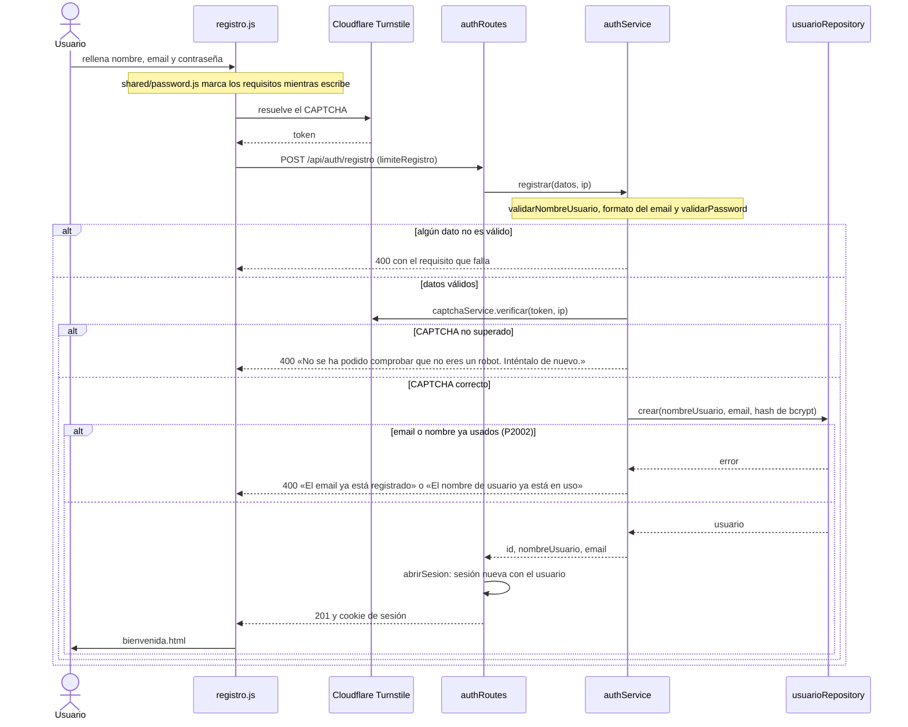
```mermaid
sequenceDiagram
  actor U as Usuario
  participant P as registro.js
  participant CF as Cloudflare Turnstile
  participant R as authRoutes
  participant S as authService
  participant DB as usuarioRepository
  U->>P: rellena nombre, email y contraseña
  Note over P: shared/password.js marca los requisitos mientras escribe
  P->>CF: resuelve el CAPTCHA
  CF-->>P: token
  P->>R: POST /api/auth/registro (limiteRegistro)
  R->>S: registrar(datos, ip)
  Note over S: validarNombreUsuario, formato del email y validarPassword
  alt algún dato no es válido
    S-->>P: 400 con el requisito que falla
  else datos válidos
    S->>CF: captchaService.verificar(token, ip)
    alt CAPTCHA no superado
      S-->>P: 400 «No se ha podido comprobar que no eres un robot. Inténtalo de nuevo.»
    else CAPTCHA correcto
      S->>DB: crear(nombreUsuario, email, hash de bcrypt)
      alt email o nombre ya usados (P2002)
        DB-->>S: error
        S-->>P: 400 «El email ya está registrado» o «El nombre de usuario ya está en uso»
      else
        DB-->>S: usuario
        S-->>R: id, nombreUsuario, email
        R->>R: abrirSesion: sesión nueva con el usuario
        R-->>P: 201 y cookie de sesión
        P->>U: bienvenida.html
      end
    end
  end
```

Qué protege: el CAPTCHA se comprueba antes de consultar la base de datos, así un programa no puede probar emails en masa para ver cuáles están registrados. Solo se guarda el hash de la contraseña.

### F2. Inicio de sesión y petición protegida

CS-59. Archivos: `index.js` → `authRoutes.js` → `authService.iniciarSesion`; después, cualquier ruta con `sesionMiddleware.requiereSesion`.

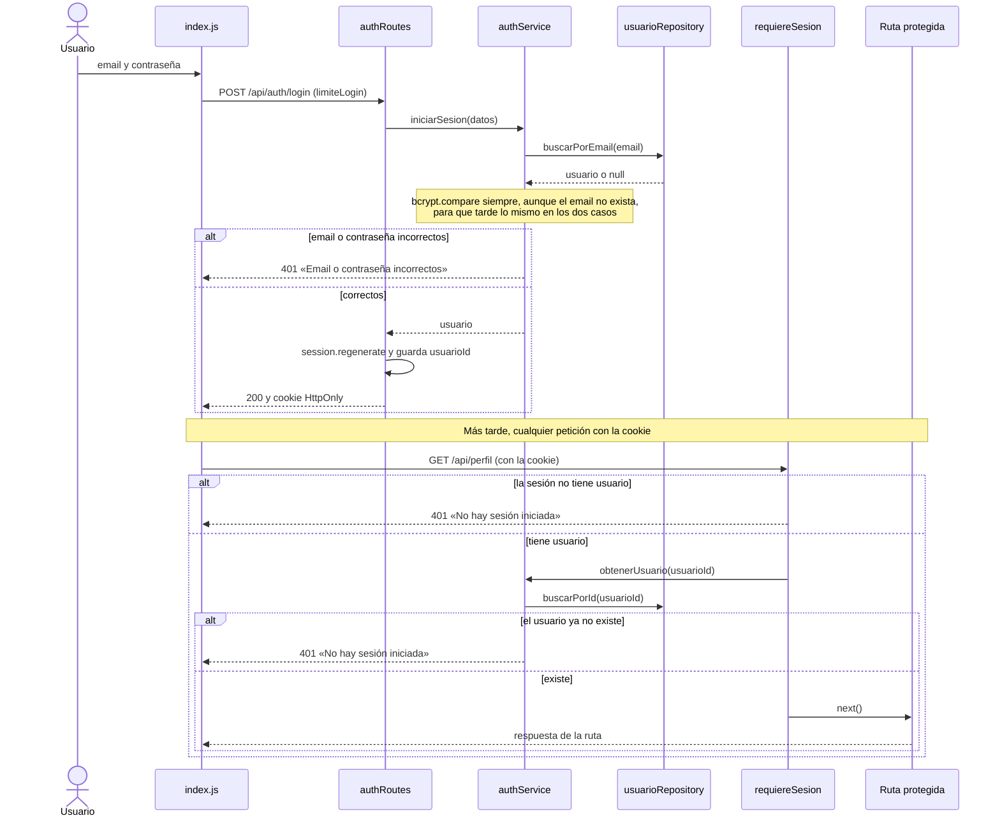
```mermaid
sequenceDiagram
  actor U as Usuario
  participant P as index.js
  participant R as authRoutes
  participant S as authService
  participant DB as usuarioRepository
  participant M as requiereSesion
  participant X as Ruta protegida
  U->>P: email y contraseña
  P->>R: POST /api/auth/login (limiteLogin)
  R->>S: iniciarSesion(datos)
  S->>DB: buscarPorEmail(email)
  DB-->>S: usuario o null
  Note over S: bcrypt.compare siempre, aunque el email no exista,<br/>para que tarde lo mismo en los dos casos
  alt email o contraseña incorrectos
    S-->>P: 401 «Email o contraseña incorrectos»
  else correctos
    S-->>R: usuario
    R->>R: session.regenerate y guarda usuarioId
    R-->>P: 200 y cookie HttpOnly
  end
  Note over P,X: Más tarde, cualquier petición con la cookie
  P->>M: GET /api/perfil (con la cookie)
  alt la sesión no tiene usuario
    M-->>P: 401 «No hay sesión iniciada»
  else tiene usuario
    M->>S: obtenerUsuario(usuarioId)
    S->>DB: buscarPorId(usuarioId)
    alt el usuario ya no existe
      S-->>P: 401 «No hay sesión iniciada»
    else existe
      M->>X: next()
      X-->>P: respuesta de la ruta
    end
  end
```

Qué protege: una sesión nueva en cada login impide reutilizar un identificador anterior (fijación de sesión), y la misma respuesta para «email inexistente» y «contraseña incorrecta» no revela qué emails tienen cuenta. Tras 10 intentos fallidos en 15 minutos responde 429.

### F3. Foto de perfil

CS-47. Archivos: `perfil.js` → `perfilRoutes.js` → `fotoMiddleware.recibirFoto` → `perfilService.actualizarFotoPropia` → `fotoRepository` (Cloudinary) y `usuarioRepository`.

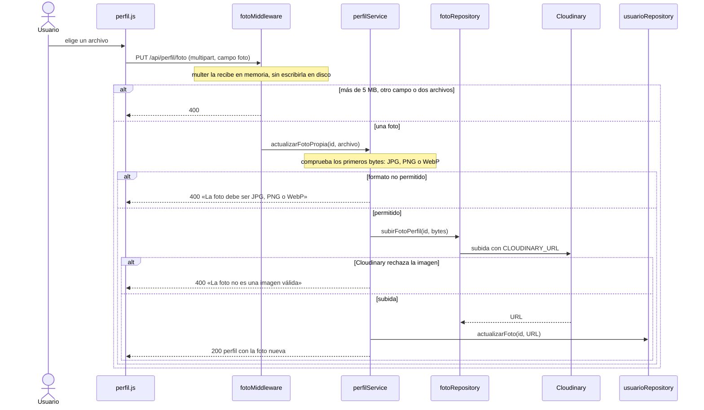
```mermaid
sequenceDiagram
  actor U as Usuario
  participant P as perfil.js
  participant F as fotoMiddleware
  participant S as perfilService
  participant C as fotoRepository
  participant CL as Cloudinary
  participant DB as usuarioRepository
  U->>P: elige un archivo
  P->>F: PUT /api/perfil/foto (multipart, campo foto)
  Note over F: multer la recibe en memoria, sin escribirla en disco
  alt más de 5 MB, otro campo o dos archivos
    F-->>P: 400
  else una foto
    F->>S: actualizarFotoPropia(id, archivo)
    Note over S: comprueba los primeros bytes: JPG, PNG o WebP
    alt formato no permitido
      S-->>P: 400 «La foto debe ser JPG, PNG o WebP»
    else permitido
      S->>C: subirFotoPerfil(id, bytes)
      C->>CL: subida con CLOUDINARY_URL
      alt Cloudinary rechaza la imagen
        S-->>P: 400 «La foto no es una imagen válida»
      else subida
        CL-->>C: URL
        S->>DB: actualizarFoto(id, URL)
        S-->>P: 200 perfil con la foto nueva
      end
    end
  end
```

Qué protege: en MySQL solo se guarda la URL; un archivo que no es una imagen se rechaza aunque tenga la extensión `.png`.

### F4. Crear y editar una experiencia

CS-49, CS-57 y CS-22. Archivos: `bienvenida.js` → `experienciaRoutes.js` → `experienciaService.crearExperiencia` o `editarExperiencia` → `ciudadRepository` y `experienciaRepository`.

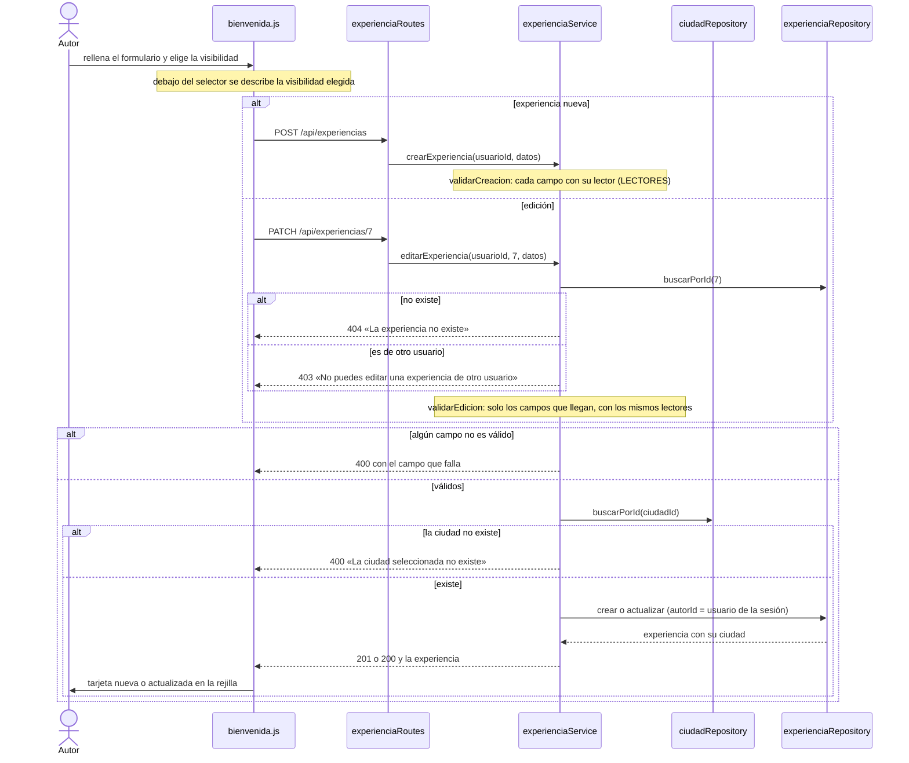
```mermaid
sequenceDiagram
  actor U as Autor
  participant P as bienvenida.js
  participant R as experienciaRoutes
  participant S as experienciaService
  participant CR as ciudadRepository
  participant ER as experienciaRepository
  U->>P: rellena el formulario y elige la visibilidad
  Note over P: debajo del selector se describe la visibilidad elegida
  alt experiencia nueva
    P->>R: POST /api/experiencias
    R->>S: crearExperiencia(usuarioId, datos)
    Note over S: validarCreacion: cada campo con su lector (LECTORES)
  else edición
    P->>R: PATCH /api/experiencias/7
    R->>S: editarExperiencia(usuarioId, 7, datos)
    S->>ER: buscarPorId(7)
    alt no existe
      S-->>P: 404 «La experiencia no existe»
    else es de otro usuario
      S-->>P: 403 «No puedes editar una experiencia de otro usuario»
    end
    Note over S: validarEdicion: solo los campos que llegan, con los mismos lectores
  end
  alt algún campo no es válido
    S-->>P: 400 con el campo que falla
  else válidos
    S->>CR: buscarPorId(ciudadId)
    alt la ciudad no existe
      S-->>P: 400 «La ciudad seleccionada no existe»
    else existe
      S->>ER: crear o actualizar (autorId = usuario de la sesión)
      ER-->>S: experiencia con su ciudad
      S-->>P: 201 o 200 y la experiencia
      P->>U: tarjeta nueva o actualizada en la rejilla
    end
  end
```

Qué protege: el autor sale siempre de la sesión y nunca del cuerpo de la petición, y la visibilidad solo admite PRIVADA, AMIGOS o PUBLICA (PUBLICA si no se indica).

### F5. Abrir una experiencia

CS-30, CS-63 y CS-48. Archivos: `experiencia.js` → `experienciaRoutes.js` y `valoracionRoutes.js` → `experienciaService.obtenerExperiencia` → `services/shared/visibilidad.js` → `amistadService.sonAmigos`.

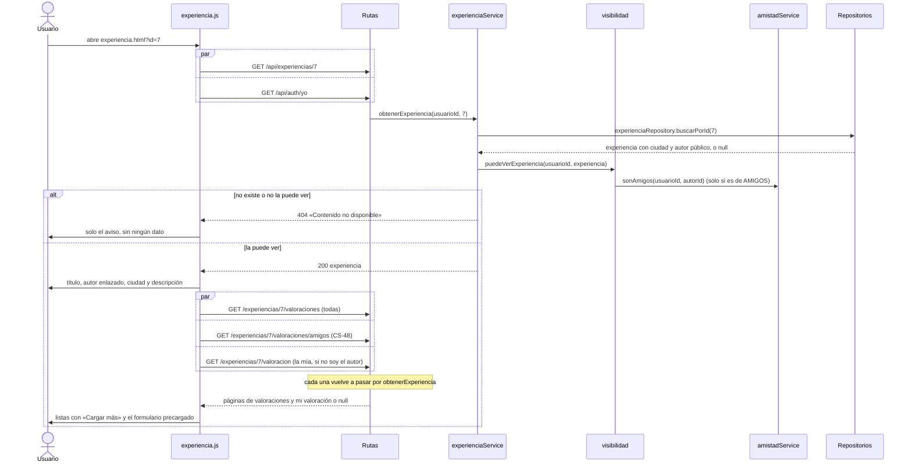
```mermaid
sequenceDiagram
  actor U as Usuario
  participant P as experiencia.js
  participant R as Rutas
  participant ES as experienciaService
  participant V as visibilidad
  participant A as amistadService
  participant DB as Repositorios
  U->>P: abre experiencia.html?id=7
  par
    P->>R: GET /api/experiencias/7
  and
    P->>R: GET /api/auth/yo
  end
  R->>ES: obtenerExperiencia(usuarioId, 7)
  ES->>DB: experienciaRepository.buscarPorId(7)
  DB-->>ES: experiencia con ciudad y autor público, o null
  ES->>V: puedeVerExperiencia(usuarioId, experiencia)
  V->>A: sonAmigos(usuarioId, autorId) (solo si es de AMIGOS)
  alt no existe o no la puede ver
    ES-->>P: 404 «Contenido no disponible»
    P->>U: solo el aviso, sin ningún dato
  else la puede ver
    ES-->>P: 200 experiencia
    P->>U: título, autor enlazado, ciudad y descripción
    par
      P->>R: GET /experiencias/7/valoraciones (todas)
    and
      P->>R: GET /experiencias/7/valoraciones/amigos (CS-48)
    and
      P->>R: GET /experiencias/7/valoracion (la mía, si no soy el autor)
    end
    Note over R: cada una vuelve a pasar por obtenerExperiencia
    R-->>P: páginas de valoraciones y mi valoración o null
    P->>U: listas con «Cargar más» y el formulario precargado
  end
```

Qué protege: el permiso se calcula en cada petición, así que una experiencia que pasa a privada deja de verse con el mismo enlace. «No existe» y «no la puedes ver» responden igual, para no revelar que existe. Si una de las peticiones posteriores responde 404, la página borra lo que mostraba.

### F6. Valorar

CS-01. Archivos: `experiencia.js` → `valoracionRoutes.js` → `valoracionService.valorarExperiencia` → `experienciaService.obtenerExperiencia` y `valoracionRepository.guardar`.

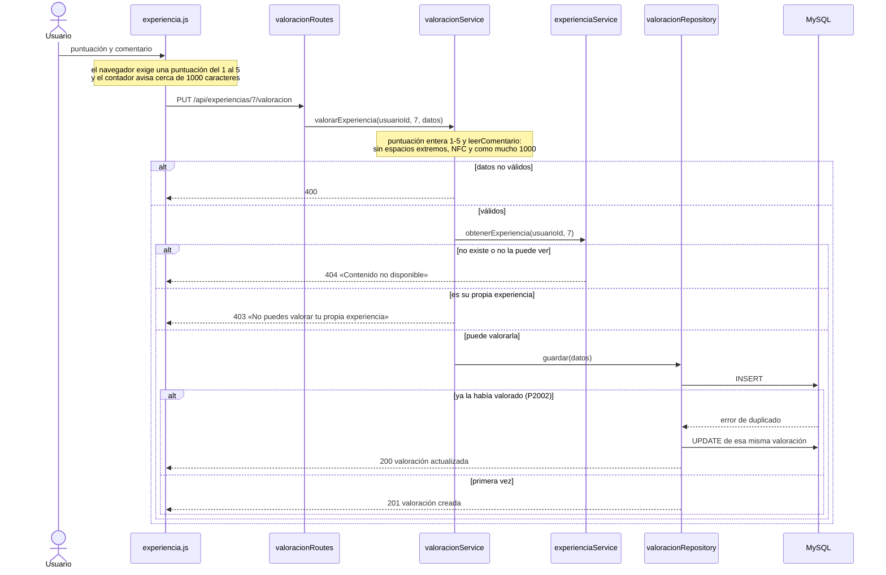
```mermaid
sequenceDiagram
  actor U as Usuario
  participant P as experiencia.js
  participant R as valoracionRoutes
  participant S as valoracionService
  participant ES as experienciaService
  participant VR as valoracionRepository
  participant BD as MySQL
  U->>P: puntuación y comentario
  Note over P: el navegador exige una puntuación del 1 al 5<br/>y el contador avisa cerca de 1000 caracteres
  P->>R: PUT /api/experiencias/7/valoracion
  R->>S: valorarExperiencia(usuarioId, 7, datos)
  Note over S: puntuación entera 1-5 y leerComentario:<br/>sin espacios extremos, NFC y como mucho 1000
  alt datos no válidos
    S-->>P: 400
  else válidos
    S->>ES: obtenerExperiencia(usuarioId, 7)
    alt no existe o no la puede ver
      ES-->>P: 404 «Contenido no disponible»
    else es su propia experiencia
      S-->>P: 403 «No puedes valorar tu propia experiencia»
    else puede valorarla
      S->>VR: guardar(datos)
      VR->>BD: INSERT
      alt ya la había valorado (P2002)
        BD-->>VR: error de duplicado
        VR->>BD: UPDATE de esa misma valoración
        VR-->>P: 200 valoración actualizada
      else primera vez
        VR-->>P: 201 valoración creada
      end
    end
  end
```

Qué protege: se intenta crear primero y la restricción única `[usuarioId, experienciaId]` la comprueba MySQL dentro del propio INSERT, así que con peticiones simultáneas nunca hay dos valoraciones del mismo usuario.

### F7. Solicitud de amistad

CS-61. Archivos: `usuario.js` o `perfil.js` → `amistadRoutes.js` → `amistadService` → `amistadRepository` y `repositories/shared/carreras.js`.

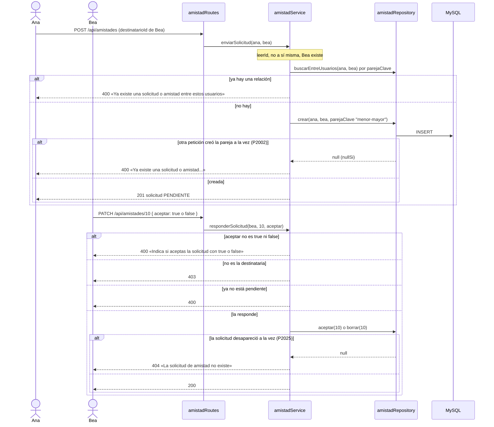
```mermaid
sequenceDiagram
  actor A as Ana
  actor B as Bea
  participant R as amistadRoutes
  participant S as amistadService
  participant AR as amistadRepository
  participant BD as MySQL
  A->>R: POST /api/amistades (destinatarioId de Bea)
  R->>S: enviarSolicitud(ana, bea)
  Note over S: leerId, no a sí misma, Bea existe
  S->>AR: buscarEntreUsuarios(ana, bea) por parejaClave
  alt ya hay una relación
    S-->>A: 400 «Ya existe una solicitud o amistad entre estos usuarios»
  else no hay
    S->>AR: crear(ana, bea, parejaClave "menor-mayor")
    AR->>BD: INSERT
    alt otra petición creó la pareja a la vez (P2002)
      AR-->>S: null (nullSi)
      S-->>A: 400 «Ya existe una solicitud o amistad...»
    else creada
      S-->>A: 201 solicitud PENDIENTE
    end
  end
  B->>R: PATCH /api/amistades/10 { aceptar: true o false }
  R->>S: responderSolicitud(bea, 10, aceptar)
  alt aceptar no es true ni false
    S-->>B: 400 «Indica si aceptas la solicitud con true o false»
  else no es la destinataria
    S-->>B: 403
  else ya no está pendiente
    S-->>B: 400
  else la responde
    S->>AR: aceptar(10) o borrar(10)
    alt la solicitud desapareció a la vez (P2025)
      AR-->>S: null
      S-->>B: 404 «La solicitud de amistad no existe»
    else
      S-->>B: 200
    end
  end
```

Qué protege: `parejaClave` es única, así que dos solicitudes cruzadas que llegan a la vez dejan una sola relación; los errores de peticiones simultáneas responden 400 o 404 en lugar de 500. Eliminar una amistad (`DELETE /api/amistades/:id`) sigue el mismo camino y solo lo pueden hacer sus dos participantes.

### F8. Seguir y dejar de seguir

CS-61. Archivos: `usuario.js` → `seguimientoRoutes.js` → `seguimientoService` → `seguimientoRepository`.

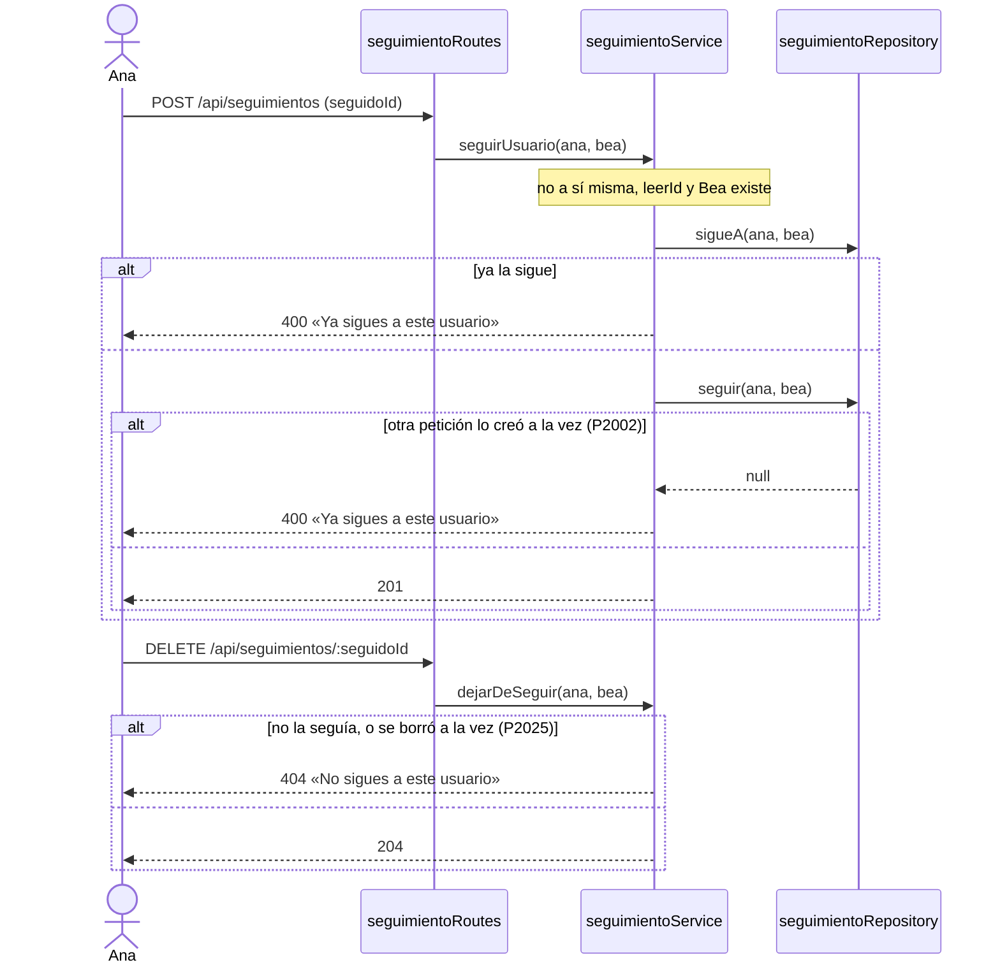
```mermaid
sequenceDiagram
  actor A as Ana
  participant R as seguimientoRoutes
  participant S as seguimientoService
  participant SR as seguimientoRepository
  A->>R: POST /api/seguimientos (seguidoId)
  R->>S: seguirUsuario(ana, bea)
  Note over S: no a sí misma, leerId y Bea existe
  S->>SR: sigueA(ana, bea)
  alt ya la sigue
    S-->>A: 400 «Ya sigues a este usuario»
  else
    S->>SR: seguir(ana, bea)
    alt otra petición lo creó a la vez (P2002)
      SR-->>S: null
      S-->>A: 400 «Ya sigues a este usuario»
    else
      S-->>A: 201
    end
  end
  A->>R: DELETE /api/seguimientos/:seguidoId
  R->>S: dejarDeSeguir(ana, bea)
  alt no la seguía, o se borró a la vez (P2025)
    S-->>A: 404 «No sigues a este usuario»
  else
    S-->>A: 204
  end
```

Qué protege: seguir no crea una amistad ni da acceso a las experiencias de amigos.

### F9. Listas con «Cargar más»

CS-44, CS-45, CS-48 y CS-63. Archivos: `js/shared/pantalla.js` (`listaConCargarMas`) → la ruta del listado → `services/shared/paginacion.js` (`leerPaginacion` y `cortarPagina`) → el repositorio.

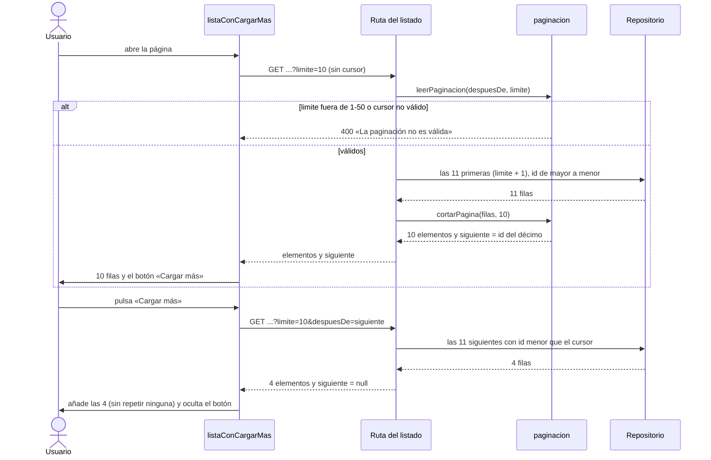
```mermaid
sequenceDiagram
  actor U as Usuario
  participant L as listaConCargarMas
  participant R as Ruta del listado
  participant PG as paginacion
  participant REP as Repositorio
  U->>L: abre la página
  L->>R: GET ...?limite=10 (sin cursor)
  R->>PG: leerPaginacion(despuesDe, limite)
  alt limite fuera de 1-50 o cursor no válido
    PG-->>L: 400 «La paginación no es válida»
  else válidos
    R->>REP: las 11 primeras (limite + 1), id de mayor a menor
    REP-->>R: 11 filas
    R->>PG: cortarPagina(filas, 10)
    PG-->>R: 10 elementos y siguiente = id del décimo
    R-->>L: elementos y siguiente
    L->>U: 10 filas y el botón «Cargar más»
  end
  U->>L: pulsa «Cargar más»
  L->>R: GET ...?limite=10&despuesDe=siguiente
  R->>REP: las 11 siguientes con id menor que el cursor
  REP-->>R: 4 filas
  R-->>L: 4 elementos y siguiente = null
  L->>U: añade las 4 (sin repetir ninguna) y oculta el botón
```

Qué protege: el cursor es el id del último elemento mostrado, así que un alta nueva entre dos peticiones no desplaza las páginas siguientes (con páginas numeradas, el último de una página volvía a salir en la siguiente). Además, MySQL usa el índice para ir directo a esas filas, sin recorrer las anteriores.

### F10. Perfil de otro usuario

CS-62 y CS-44. Archivos: `usuario.js` → `usuarioRoutes.js` → `usuarioService.obtenerPerfilPublico`; sus experiencias con `js/shared/experiencias.js` → `experienciaService.listarDeAutor`.

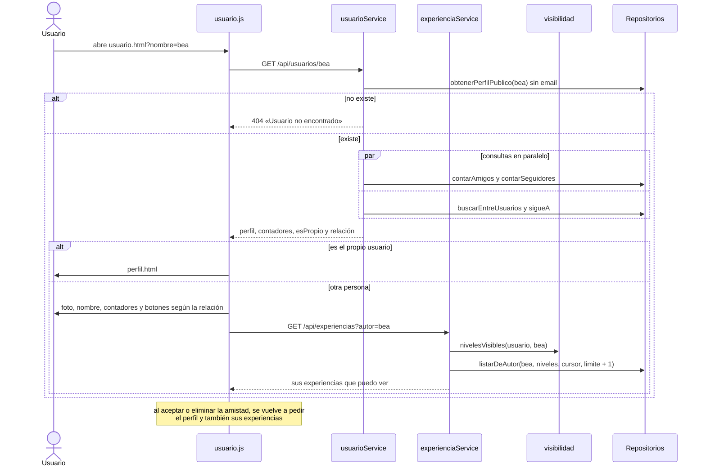
```mermaid
sequenceDiagram
  actor U as Usuario
  participant P as usuario.js
  participant US as usuarioService
  participant ES as experienciaService
  participant V as visibilidad
  participant DB as Repositorios
  U->>P: abre usuario.html?nombre=bea
  P->>US: GET /api/usuarios/bea
  US->>DB: obtenerPerfilPublico(bea) sin email
  alt no existe
    US-->>P: 404 «Usuario no encontrado»
  else existe
    par consultas en paralelo
      US->>DB: contarAmigos y contarSeguidores
    and
      US->>DB: buscarEntreUsuarios y sigueA
    end
    US-->>P: perfil, contadores, esPropio y relación
    alt es el propio usuario
      P->>U: perfil.html
    else otra persona
      P->>U: foto, nombre, contadores y botones según la relación
      P->>ES: GET /api/experiencias?autor=bea
      ES->>V: nivelesVisibles(usuario, bea)
      ES->>DB: listarDeAutor(bea, niveles, cursor, limite + 1)
      ES-->>P: sus experiencias que puedo ver
    end
  end
  Note over P: al aceptar o eliminar la amistad, se vuelve a pedir<br/>el perfil y también sus experiencias
```

Qué protege: el listado filtra la visibilidad dentro de la consulta, así que nunca llega al navegador una experiencia que el usuario no puede ver.

### F11. Recuperar y restablecer la contraseña

CS-64. Archivos: `recuperar.js` y `restablecer.js` → `authRoutes.js` (`limiteRecuperacion`) → `authService.solicitarRecuperacion` y `restablecerPassword` → `tokenRecuperacionRepository` y `emailRepository`.

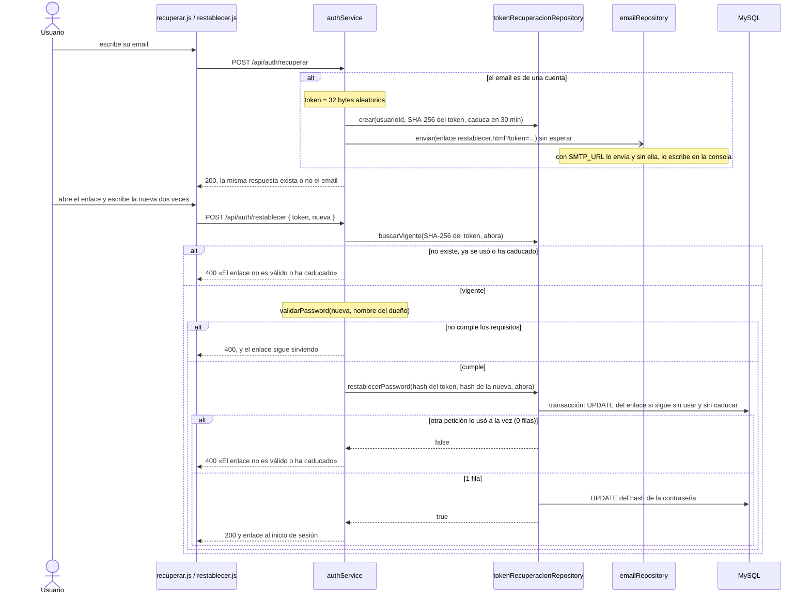
```mermaid
sequenceDiagram
  actor U as Usuario
  participant P as recuperar.js / restablecer.js
  participant S as authService
  participant T as tokenRecuperacionRepository
  participant E as emailRepository
  participant BD as MySQL
  U->>P: escribe su email
  P->>S: POST /api/auth/recuperar
  alt el email es de una cuenta
    Note over S: token = 32 bytes aleatorios
    S->>T: crear(usuarioId, SHA-256 del token, caduca en 30 min)
    S-)E: enviar(enlace restablecer.html?token=...) sin esperar
    Note over E: con SMTP_URL lo envía y sin ella, lo escribe en la consola
  end
  S-->>P: 200, la misma respuesta exista o no el email
  U->>P: abre el enlace y escribe la nueva dos veces
  P->>S: POST /api/auth/restablecer { token, nueva }
  S->>T: buscarVigente(SHA-256 del token, ahora)
  alt no existe, ya se usó o ha caducado
    S-->>P: 400 «El enlace no es válido o ha caducado»
  else vigente
    Note over S: validarPassword(nueva, nombre del dueño)
    alt no cumple los requisitos
      S-->>P: 400, y el enlace sigue sirviendo
    else cumple
      S->>T: restablecerPassword(hash del token, hash de la nueva, ahora)
      T->>BD: transacción: UPDATE del enlace si sigue sin usar y sin caducar
      alt otra petición lo usó a la vez (0 filas)
        T-->>S: false
        S-->>P: 400 «El enlace no es válido o ha caducado»
      else 1 fila
        T->>BD: UPDATE del hash de la contraseña
        T-->>S: true
        S-->>P: 200 y enlace al inicio de sesión
      end
    end
  end
```

Qué protege: en la base de datos solo está el hash del token, así que con acceso a ella no se puede usar ningún enlace; el envío no se espera, para que la respuesta no tarde más si el email existe; y el enlace se consume con un único UPDATE condicionado, de modo que dos restablecimientos simultáneos con el mismo enlace no pueden funcionar los dos.

### F12. Cambiar la contraseña

CS-64. Archivos: `perfil.js` → `perfilRoutes.js` (`limiteCambioPassword`) → `perfilService.cambiarPassword` → `usuarioRepository`.

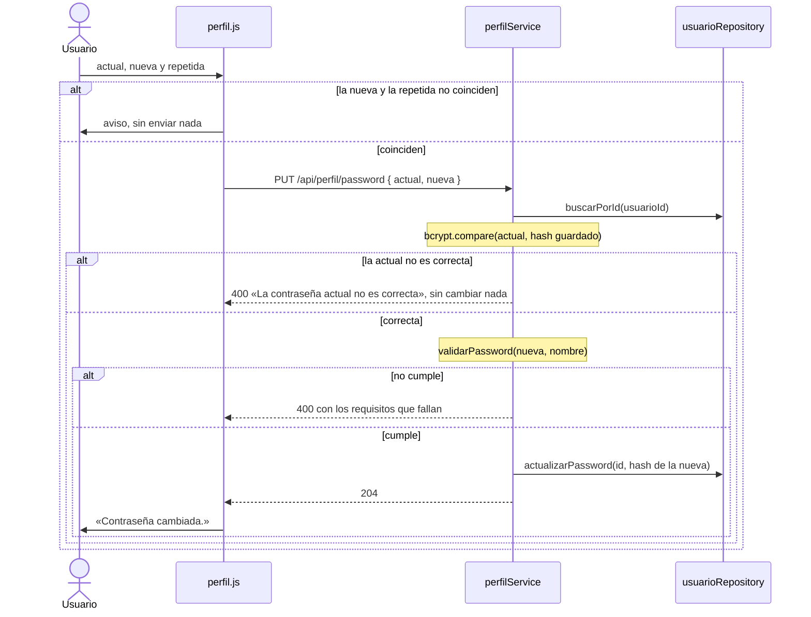
```mermaid
sequenceDiagram
  actor U as Usuario
  participant P as perfil.js
  participant S as perfilService
  participant DB as usuarioRepository
  U->>P: actual, nueva y repetida
  alt la nueva y la repetida no coinciden
    P->>U: aviso, sin enviar nada
  else coinciden
    P->>S: PUT /api/perfil/password { actual, nueva }
    S->>DB: buscarPorId(usuarioId)
    Note over S: bcrypt.compare(actual, hash guardado)
    alt la actual no es correcta
      S-->>P: 400 «La contraseña actual no es correcta», sin cambiar nada
    else correcta
      Note over S: validarPassword(nueva, nombre)
      alt no cumple
        S-->>P: 400 con los requisitos que fallan
      else cumple
        S->>DB: actualizarPassword(id, hash de la nueva)
        S-->>P: 204
        P->>U: «Contraseña cambiada.»
      end
    end
  end
```

Qué protege: sin la contraseña actual no se puede cambiar, aunque alguien tenga la sesión abierta; tras 10 intentos fallidos en 15 minutos responde 429. Después, el login funciona con la nueva y falla con la antigua.

---

## Estados

### E1. Amistad

CS-61. Una fila de la tabla `Amistad` entre dos usuarios A y B.

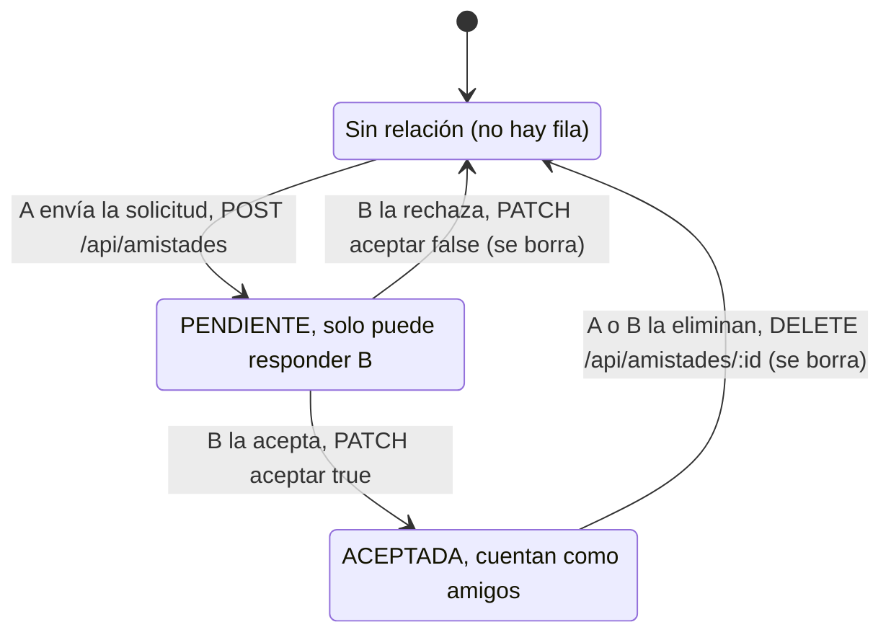
```mermaid
stateDiagram-v2
  [*] --> SinRelacion
  SinRelacion --> PENDIENTE : A envía la solicitud, POST /api/amistades
  PENDIENTE --> ACEPTADA : B la acepta, PATCH aceptar true
  PENDIENTE --> SinRelacion : B la rechaza, PATCH aceptar false (se borra)
  ACEPTADA --> SinRelacion : A o B la eliminan, DELETE /api/amistades/:id (se borra)
  SinRelacion : Sin relación (no hay fila)
  PENDIENTE : PENDIENTE, solo puede responder B
  ACEPTADA : ACEPTADA, cuentan como amigos
```

Solo una solicitud ACEPTADA da acceso a las experiencias de amigos y cuenta en el número de amigos (CS-45). Tras rechazar o eliminar se puede volver a enviar una solicitud, en cualquier sentido.

### E2. La relación vista desde el perfil de otro usuario

CS-62. Lo que devuelve `GET /api/usuarios/:nombreUsuario` en `relacion.amistad`, y los botones que muestra `usuario.html`. «Seguir» es independiente.

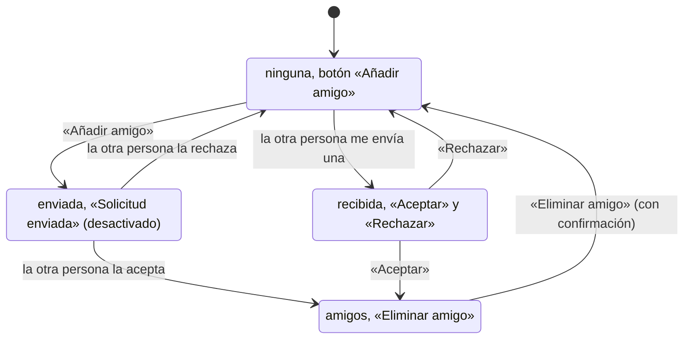
```mermaid
stateDiagram-v2
  [*] --> ninguna
  ninguna --> enviada : «Añadir amigo»
  enviada --> ninguna : la otra persona la rechaza
  enviada --> amigos : la otra persona la acepta
  ninguna --> recibida : la otra persona me envía una
  recibida --> amigos : «Aceptar»
  recibida --> ninguna : «Rechazar»
  amigos --> ninguna : «Eliminar amigo» (con confirmación)
  ninguna : ninguna, botón «Añadir amigo»
  enviada : enviada, «Solicitud enviada» (desactivado)
  recibida : recibida, «Aceptar» y «Rechazar»
  amigos : amigos, «Eliminar amigo»
```

Al pasar a `amigos` o volver a `ninguna`, la página vuelve a pedir «Sus experiencias», porque cambia cuáles se pueden ver.

### E3. Valoración de un usuario en una experiencia

CS-01 y CS-63.

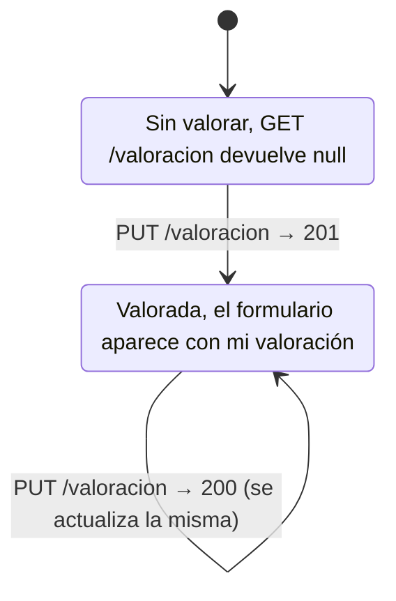
```mermaid
stateDiagram-v2
  [*] --> SinValorar
  SinValorar --> Valorada : PUT /valoracion → 201
  Valorada --> Valorada : PUT /valoracion → 200 (se actualiza la misma)
  SinValorar : Sin valorar, GET /valoracion devuelve null
  Valorada : Valorada, el formulario aparece con mi valoración
```

### E4. Enlace de recuperación de la contraseña

CS-64. Una fila de `TokenRecuperacion`.

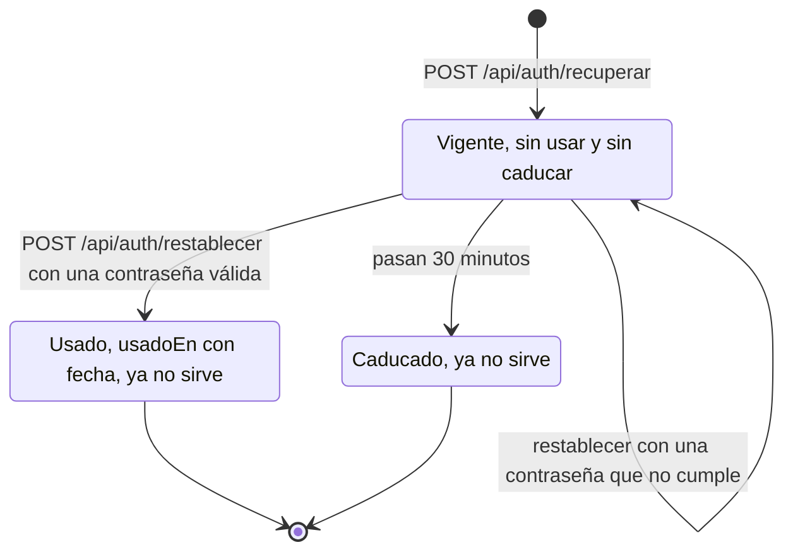
```mermaid
stateDiagram-v2
  [*] --> Vigente : POST /api/auth/recuperar
  Vigente --> Usado : POST /api/auth/restablecer con una contraseña válida
  Vigente --> Vigente : restablecer con una contraseña que no cumple
  Vigente --> Caducado : pasan 30 minutos
  Usado --> [*]
  Caducado --> [*]
  Vigente : Vigente, sin usar y sin caducar
  Usado : Usado, usadoEn con fecha, ya no sirve
  Caducado : Caducado, ya no sirve
```
