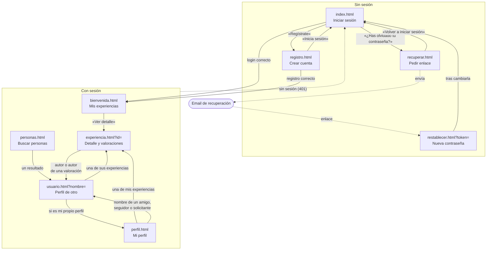
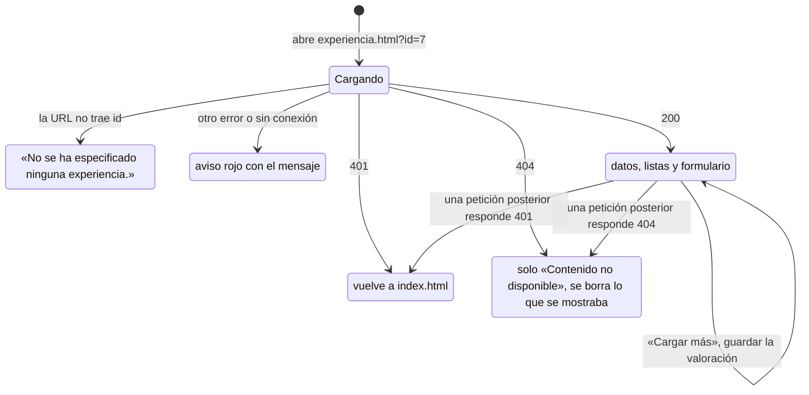
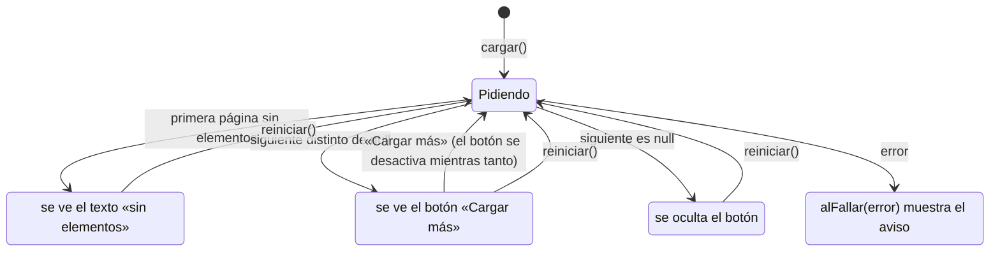

# Pantallas del frontend — PlanB

> Qué pantallas hay, cómo se pasa de una a otra, qué archivos usa cada una y qué llamadas hace a la API.
> Documentos relacionados: [arquitectura](arquitectura.md), [flujos](flujos.md), [referencia de la API](api.md) y [glosario](glosario.md).

El frontend son páginas HTML estáticas con JavaScript sin *framework* y estilos de Bootstrap 5. El mismo servidor Express sirve las páginas desde `frontend/` y la API desde `/api`, así que comparten origen y la cookie de sesión viaja sola en cada `fetch`.

## Mapa de navegación

Las cajas son páginas; las flechas, enlaces o redirecciones. Las cinco páginas con sesión comparten la misma barra superior (PlanB e Inicio llevan a `bienvenida.html`; además, «Buscar personas» y «Mi perfil»), que no se dibuja para no llenar el mapa de flechas.

Un enlace a un usuario lleva a `perfil.html` si es el propio usuario y a `usuario.html?nombre=...` si es otro: lo decide `crearEnlacePerfil` (en `js/shared/pantalla.js`). Si una página con sesión recibe 401, vuelve a `index.html` con `irAlLogin`.

## Páginas, archivos y llamadas

Cada página carga primero `js/shared/api.js`, después los módulos compartidos que necesita y por último su script.

| Página | Script | Módulos compartidos | Llamadas a la API | Historias |
|---|---|---|---|---|
| `index.html` | `index.js` | `api` | `POST /auth/login` | CS-59 |
| `registro.html` | `registro.js` | `api`, `password` y Turnstile | `GET /auth/captcha`, `POST /auth/registro` | CS-59, CS-64 |
| `recuperar.html` | `recuperar.js` | `api` | `POST /auth/recuperar` | CS-64 |
| `restablecer.html` | `restablecer.js` | `api`, `password` | `POST /auth/restablecer` | CS-64 |
| `bienvenida.html` | `bienvenida.js` | `api`, `pantalla` | `GET /auth/yo`, `GET /ciudades`, `GET /experiencias?autor=`, `POST /experiencias`, `PATCH /experiencias/:id` | CS-44, CS-49, CS-57, CS-22 |
| `perfil.html` | `perfil.js` | `api`, `pantalla`, `experiencias`, `password` | `GET` y `PUT /perfil`, `PUT /perfil/foto`, `PUT /perfil/password`, `GET /perfil/resumen`, `/perfil/amigos` y `/perfil/seguidores`, `GET /amistades/solicitudes`, `PATCH /amistades/:id`, `GET /experiencias?autor=` | CS-47, CS-45, CS-61, CS-44, CS-64 |
| `personas.html` | `personas.js` | `api`, `pantalla` | `GET /auth/yo`, `GET /usuarios?texto=` | CS-61 |
| `usuario.html` | `usuario.js` | `api`, `pantalla`, `experiencias` | `GET /usuarios/:nombre`, `POST` y `DELETE /amistades`, `PATCH /amistades/:id`, `POST` y `DELETE /seguimientos`, `GET /experiencias?autor=` | CS-62, CS-61, CS-44 |
| `experiencia.html` | `experiencia.js` | `api`, `pantalla` | `GET /experiencias/:id`, `GET /auth/yo`, `GET` y `PUT /experiencias/:id/valoracion`, `GET /experiencias/:id/valoraciones` y `/valoraciones/amigos` | CS-30, CS-63, CS-48, CS-01 |

## Estados de una pantalla

Casi todas las pantallas con datos pasan por los mismos estados. Este es el de `experiencia.html`, el más completo; `usuario.html` es igual, pero el aviso que muestra es «Usuario no encontrado».

Cada lista con «Cargar más» tiene, a su vez, sus propios estados, que gestiona `listaConCargarMas`:

## Cada página

### `index.html`: iniciar sesión

Formulario de email y contraseña. Si el login es correcto va a `bienvenida.html`; si no, muestra el mensaje del servidor en `#error-login`. Enlaza a registro y a «¿Has olvidado tu contraseña?».

Pruebas: `login.test.js`.

### `registro.html`: crear una cuenta

* Pide nombre de usuario, email y contraseña. Mientras se escribe la contraseña, `mostrarRequisitosPassword` marca cada requisito cumplido en `#requisitos-password`, también el de no contener el nombre.
* El CAPTCHA de Cloudflare Turnstile se dibuja en `#captcha` cuando su script llama a `window.iniciarCaptcha`, con la clave pública de `GET /api/auth/captcha`.
* Con el registro correcto, la sesión ya está abierta y va a `bienvenida.html`.

Pruebas: `registro.test.js`.

### `recuperar.html`: pedir el enlace

Pide el email y siempre muestra el mismo mensaje de éxito, exista la cuenta o no: la página no lo sabe, y así nadie puede usarla para averiguarlo.

Pruebas: `recuperacion.test.js`.

### `restablecer.html`: elegir una contraseña nueva

* Lee el `token` de la URL. Sin token muestra el aviso y oculta el formulario.
* Pide la contraseña dos veces y comprueba en la pantalla que coinciden antes de enviarla. El requisito «sin el nombre de usuario» lo comprueba el servidor, porque la página no sabe de quién es el enlace.
* Al terminar, muestra un enlace a `index.html`.

Pruebas: `recuperacion.test.js`.

### `bienvenida.html`: mis experiencias

* Saluda al usuario y muestra sus experiencias en una rejilla, de 10 en 10, con «Cargar más» (`#mas-experiencias`).
* La primera tarjeta, «+», abre el `<dialog>` `#dialogo-experiencia` para crear una experiencia. «Editar» abre el mismo diálogo relleno con sus datos.
* Debajo del selector de visibilidad, `#descripcion-visibilidad` explica la opción elegida.
* Al guardar, la tarjeta nueva aparece la primera y la editada se sustituye en su sitio, sin recargar la página.
* El desplegable de ciudades se llena con `GET /api/ciudades`.

Pruebas: `bienvenida.test.js`.

### `perfil.html`: mi perfil

* **Datos:** nombre de usuario y ciudad editables, email solo de lectura, y la foto, que se sube nada más elegirla.
* **Cambiar la contraseña:** actual, nueva y repetida, con la lista de requisitos.
* **Mis experiencias:** con `mostrarExperienciasDe`, incluidas las privadas.
* **Solicitudes recibidas:** cada una con «Aceptar» y «Rechazar». Al aceptar se recargan los contadores, la lista de amigos y mis experiencias.
* **Amigos y seguidores:** contadores y dos listas de 20 en 20 con «Cargar más». Cada nombre lleva a su perfil.

Pruebas: `perfil.foto.test.js`, `perfil.password.test.js`, `perfil.relaciones.test.js`, `perfil.solicitudes.test.js` y `shared/experiencias.test.js`.

### `personas.html`: buscar personas

Un buscador por parte del nombre (como mucho 20 resultados). Cada resultado es un enlace a su perfil.

Pruebas: `personas.test.js`.

### `usuario.html?nombre=`: perfil de otro usuario

* Foto, nombre, ciudad y contadores de amigos y seguidores. Si el usuario no existe, solo se muestra `#no-encontrado`; si es el propio usuario, va a `perfil.html`.
* En `#botones-amistad` aparecen los botones que corresponden a la relación (ver [E2](flujos.md#e2-la-relación-vista-desde-el-perfil-de-otro-usuario)). «Eliminar amigo» pide confirmación.
* `#boton-seguir` alterna entre «Seguir» y «Dejar de seguir».
* Tras cada acción se vuelve a pedir el perfil, para que los contadores y botones sean los reales, y también «Sus experiencias», porque al cambiar la amistad cambian las que se pueden ver.

Pruebas: `usuario.test.js` y `shared/experiencias.test.js`.

### `experiencia.html?id=`: una experiencia

* Título, autor (enlace a su perfil), ciudad y descripción.
* **Valorar:** el formulario solo aparece si no soy el autor y se rellena con mi valoración si ya la había hecho. La puntuación es obligatoria (1–5) y `#contador-caracteres` cuenta hasta 1000. El botón «Guardar» pasa a «Actualizar valoración» cuando ya existe una.
* **Valoraciones de amigos y seguidores** (CS-48) y **todas las valoraciones** (CS-63): dos listas de 10 en 10 con «Cargar más».
* **«Útil» y «Reportar»:** solo funcionan en la pantalla y no guardan nada, hasta que se implementen CS-02 y CS-04. «Reportar» abre el `<dialog>` `#dialogo-reporte`.
* Si cualquier petición responde 404, se borra lo que se mostraba y queda solo «Contenido no disponible».

Pruebas: `experiencia.test.js` y `experiencia.formulario.test.js`.

## Módulos compartidos (`js/shared/`)

| Archivo | Ofrece | Lo usan |
|---|---|---|
| `api.js` | `api(ruta, opciones)`: llama a `/api` + `ruta` con `fetch` y la cookie de sesión. Envía `Content-Type: application/json` salvo con `FormData`, en cuyo caso la cabecera la pone el navegador. Devuelve el JSON (o `null` si no hay cuerpo); si falla, lanza un `Error` con el mensaje del servidor y `error.status`. | Todas las páginas |
| `pantalla.js` | `mostrarMensaje(caja, texto)` y `ocultarMensaje(caja)`; `irAlLogin()`; `crearEnlacePerfil(enlace, usuario, miUsuarioId)`; `listaConCargarMas({ lista, vacio, botonMas, pedir, crear, alFallar })`, que devuelve `{ cargar, reiniciar }` y no repite un elemento que ya está en la lista. | Las páginas con sesión y `experiencias.js` |
| `experiencias.js` | `mostrarExperienciasDe(nombreUsuario)` y `recargarExperiencias()`: la lista «Cargar más» de experiencias de un autor. La página debe tener `#lista-experiencias`, `#sin-experiencias`, `#mas-experiencias` y `#error-experiencias`. | `perfil.js`, `usuario.js` |
| `password.js` | `mostrarRequisitosPassword(campo, lista, obtenerNombre)`: marca los requisitos cumplidos mientras se escribe. Son los mismos que comprueba el backend, que es quien decide. | `registro.js`, `perfil.js`, `restablecer.js` |

Los módulos se cargan con `<script>` normales (no son módulos ES) y exponen sus funciones con `window.nombre = nombre`, para que se vea qué ofrece cada archivo y las pruebas puedan cargarlos.

## Reglas del frontend

* **Sin scripts en línea.** La política CSP de Helmet los bloquea: nada de `onclick=` ni `<script>` con código dentro del HTML. Los eventos se asignan con `addEventListener` en el JS de la página.
* **Texto de usuarios con `textContent`.** Nunca con `innerHTML`, para que un nombre o comentario con HTML se vea como texto y no se ejecute. `innerHTML` solo se usa para estructuras fijas sin datos, como el esqueleto de una tarjeta.
* **Ventanas con `<dialog>`.** La CSP no deja cargar el JavaScript de Bootstrap desde el CDN, así que los diálogos usan el elemento nativo `<dialog>` con `showModal()` y `close()`.
* **La seguridad está en el backend.** Ocultar un botón (por ejemplo, el formulario de valorar en una experiencia propia) solo mejora la interfaz: el servidor comprueba siempre los permisos.
* **Llamadas con `api`.** Ninguna página usa `fetch` directamente.
* **Escritorio y móvil.** Las rejillas y formularios usan las clases de Bootstrap (`row-cols-*`, `col-md-*`) para adaptarse; un cambio de interfaz se comprueba en los dos tamaños.

## Pruebas del frontend

Las pruebas están en `backend/tests/frontend/`, agrupadas por página y tema (`perfil.foto.test.js`, `perfil.password.test.js`...), y en `backend/tests/frontend/shared/`. `navegacion.test.js` comprueba que todas las páginas con sesión tienen la misma barra. Usan Jest con jsdom: cargan el HTML real de la página, simulan `fetch` y comprueban lo que ve el usuario. El ayudante `tests/helpers/pantalla.js` carga los scripts en orden, igual que el navegador. Se ejecutan con el resto: `npm test` desde `backend/`.
